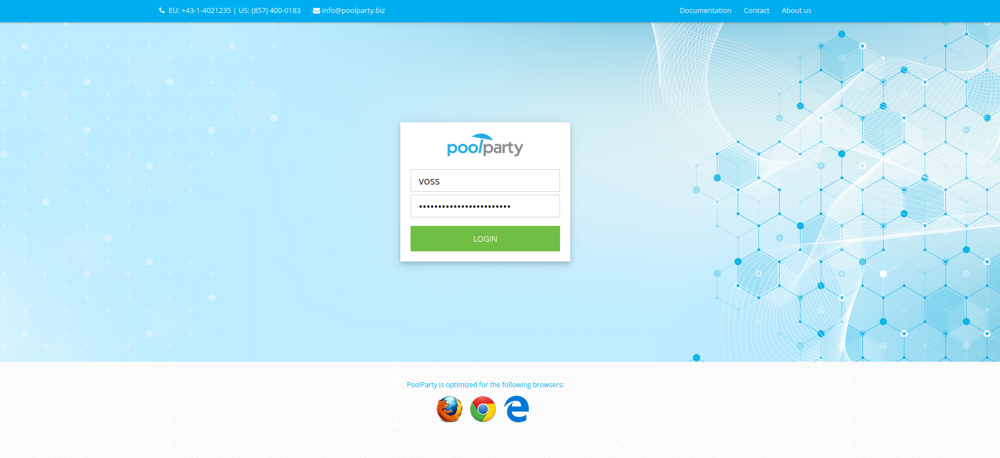
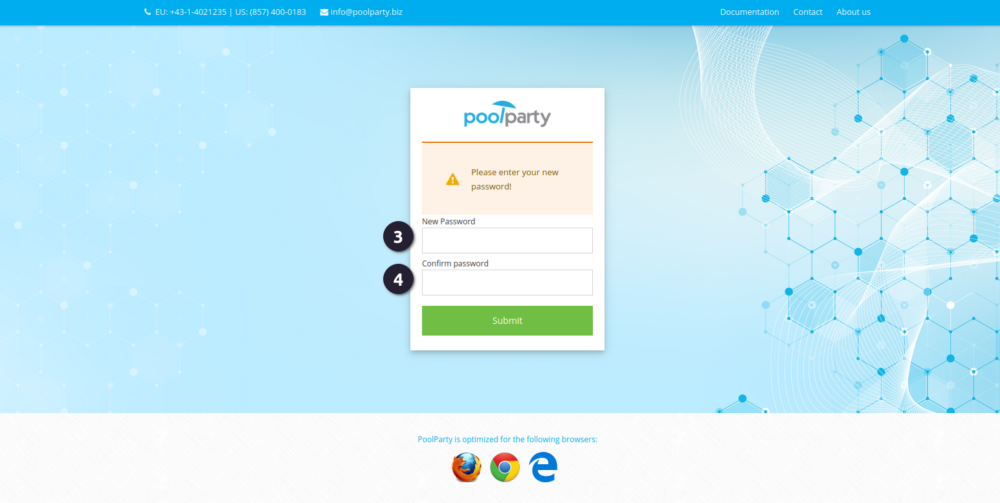

{: .no_toc .text-delta }

Als je voor de eerste keer inlogt in PoolParty, moet je [1] de gebruikersnaam en het [2] eenmalig te gebruiken wachtwoord gebruiken die je hebt ontvangen via thesauri@cultureelerggoed.nl.

[4] Bij de eerste keer inloggen word je gevraagd om je wachtwoord te wijzigen. Zorg ervoor dat je een veilig wachtwoord aanmaakt en dit goed noteert.  
[5] Bevestig de wijzigingen door op 'Submit' te klikken.

{: .important}
> Let op: je wachtwoord moet minimaal 8 tekens lang zijn.

Eenmaal ingelogd kom je op het beginscherm, waar je kunt navigeren naar bestaande projecten of een nieuw project kunt starten.

{: .important}
> Let op: Als je na 1 jaar niet hebt ingelogd, ontvang je een e-mail van ons. Mocht je hier niet op reageren, dan vervallen je inloggegevens, en zul je nieuwe inloggegevens bij ons moeten aanvragen.
