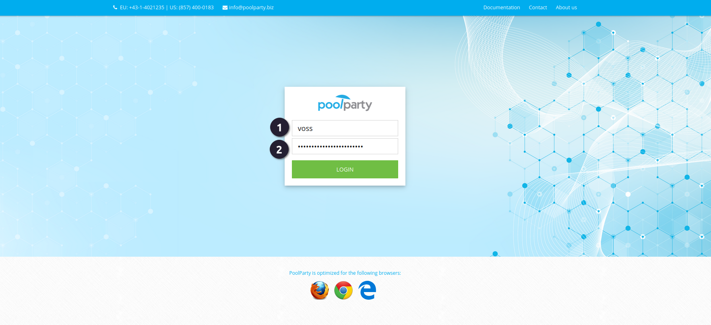
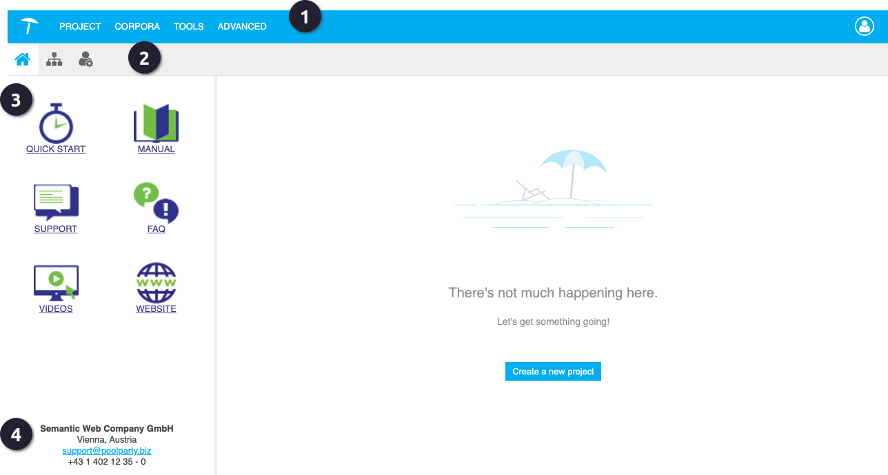

{: .no_toc .text-delta }

<!-- Overlay (only once) -->

  
  

Om toegang te krijgen tot PoolParty, moet je inloggen met een gebruikersnaam en wachtwoord. Bij je eerste keer inloggen ontvang je een eenmalig te gebruiken wachtwoord via e-mail. Nadat je bent ingelogd, wordt meestal gevraagd om je wachtwoord te wijzigen voor extra veiligheid. Zie hieronder de stappen om in te loggen.

Bij het eerste keer inloggen in PoolParty zal je  **De gebruikersnaam** en het **eenmalig te gebruiken wachtwoord** invoeren die je hebt ontvangen via [thesauri@cultureelerggoed.nl](mailto:thesauri@cultureelerggoed.nl).

 Ook zal je gevraagd worden om je wachtwoord te wijzigen. Zorg ervoor dat je een veilig wachtwoord aanmaakt en dit goed noteert.  

**4** Voer je wachtwoord nogmaals in en bevestig de wijzigingen door op 'Submit' te klikken.

{: .important}
> Let op: je wachtwoord moet minimaal 8 tekens lang zijn.

Eenmaal ingelogd kom je op het beginscherm, waar je kunt navigeren naar bestaande projecten. Bij de RCE worden projecten altijd voor je aangemaakt na overleg; je kunt zelf geen nieuw project starten.

*Navigeer naar het volgende hoofdstuk: [De PoolParty omgeving](https://cultureelerfgoed.github.io/Poolparty-User-Documentation/docs/2%20gebruikershandleiding/2.2%20poolparty-omgeving.html) voor verder uitleg.*

{: .important}
> Let op: Als je langer dan een jaar niet inlogt, ontvang je een e-mail van ons. Reageer je hier niet op, dan vervallen je inloggegevens en moet je nieuwe inloggegevens bij ons aanvragen.
