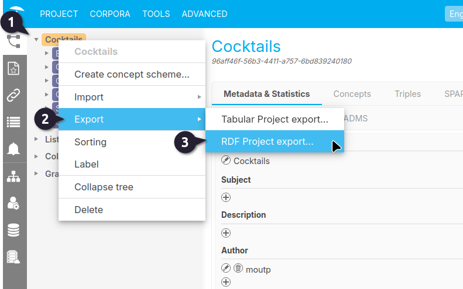
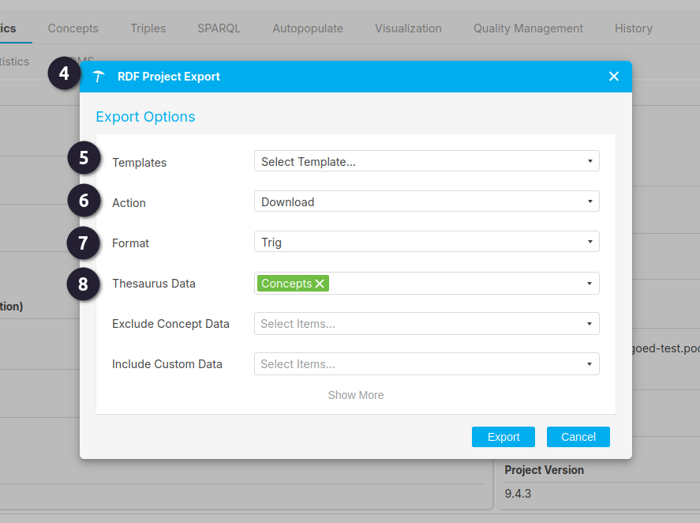
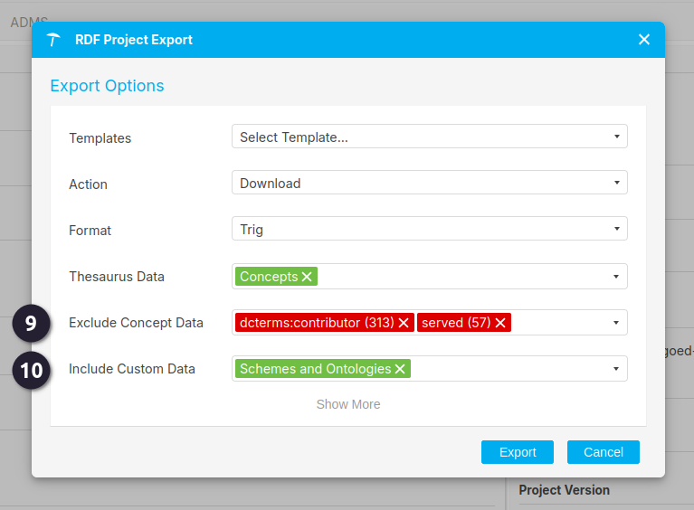
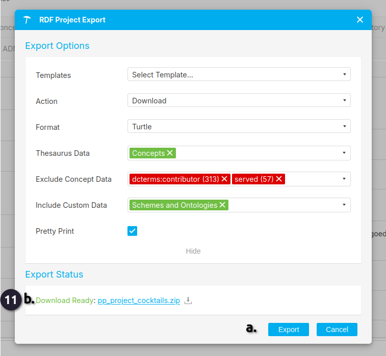

{: .no_toc .text-delta }

<!-- Overlay (only once) -->

  
  

# Backup en Export Project

Poolparty maakt zelf automatisch backups. Daar hoef je niks voor te doen.
Wil je nu flink experimenteren dan kun je het hele project exporteren als excel sheet of als
RFD project.
Als je het gehele project als RDF exporteert en dan Create project kiest en dan Create from
file een nieuwe thesaurus maakt, dan kun je een testkopie van deze thesaurus maken en
bewerken.

{: .important }
> Documentatie, geolocaties enzovoorts komen NIET mee in de excel export. Die komen alleen mee in de TRIX en TRIG exports via RDF export. De SKOS gegevens komen wel in excel mee.

Je kunt ook een term of een subtree exporteren door de term of subtree aan te klikken en
dan rechtermuisknop.

---

# Exporteren van een project als RDF
Je kan het gehele project exporteren als RDF of een backup te maken of kopie (waar je in kan editen). 

 Ga naar je PoolParty project en **rechtemuisklik** op de Project node.  
 Selecteer exporteren.  
 Er verschijnt een submenu met 2 opties; kies **RDF Project export**.  

 De menu **RDF Project Export** opent.

Nu kunnen de opties voor het project geselecteerd worden.

 Voor de template kan gekozen worden welke template te gebruiken.  
 Voor de **Action** keuzelijst; is er de keuze voor **Store on Server** of **Download**.  
 Voor de **Format** kan gekozen worden in welke format (N3, Trig, N-Quads, Trix, Binary-RDF, RDF/XML, Turtle) de Project in geexporteerd dient te worden.  
 Voor de optie **Thesaurus Data** kun je kiezen uit meerdere opties om mee te nemen met de export.   
Onder ander:
    - Concepts  
    - Workflows  
    - Suggested Concepts   
    - SPARQL Lists   
    - VoID   
    - ADMS  
    - Deprecated Concepts   
    - Linked Data  
    - DBpedia Categories  
    - SKOS Notes  
    - Users  
    - Exclude-listed Terms  
    - Configuration (van de graph dat de export metadata bevat)  
    - Classifier  

 Het is ook mogelijk om concept data weg te filteren van de thesaurus. De filters zijn relaties/predicaten die aanwezig zijn in the thesaurus data. Het aantal tussen haakjes, bijvoorbeeld (4), geeft aan hoe vaak deze relatie/predicaat gebruikt wordt in the thesaurus. Wanneer er bijvoorbeeld een custom ontology gekoppeld is aan de thesaurus, dan zullen er meer relaties/predicaten zijn die mogelijk weggefilterd kunnen worden.

 Voor **Custom Data** kan gekozen worden tussen: *History*, *Candidate Concepts*, *Corpora*, en *Schemes and Ontologies*. 

 11.   
    a) Voor het exporteren kan nog gekozen worden voor **Pretty Print** om de data in een RDF format op te slaan. En klik **Export** en een .zip bestand wordt aangemaakt.     
    b) Door op het aangemaakte bestand te klikken zal het gedownload worden naar de computer.  

---

Zie ook:

[Exporting a Project to RDF](https://help.poolparty.biz/en/user-guide-for-knowledge-engineers/basic-features/import,-export-and-reporting-with-poolparty/poolparty-rdf-import---export/exporting-a-project-to-rdf.html)