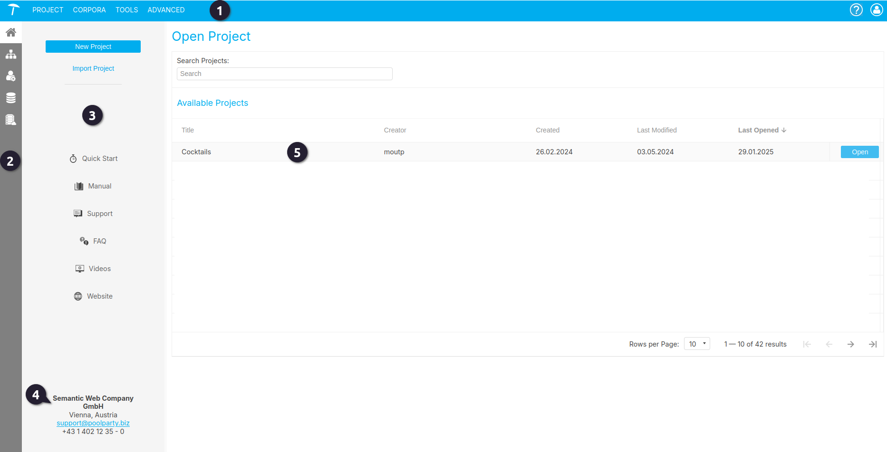
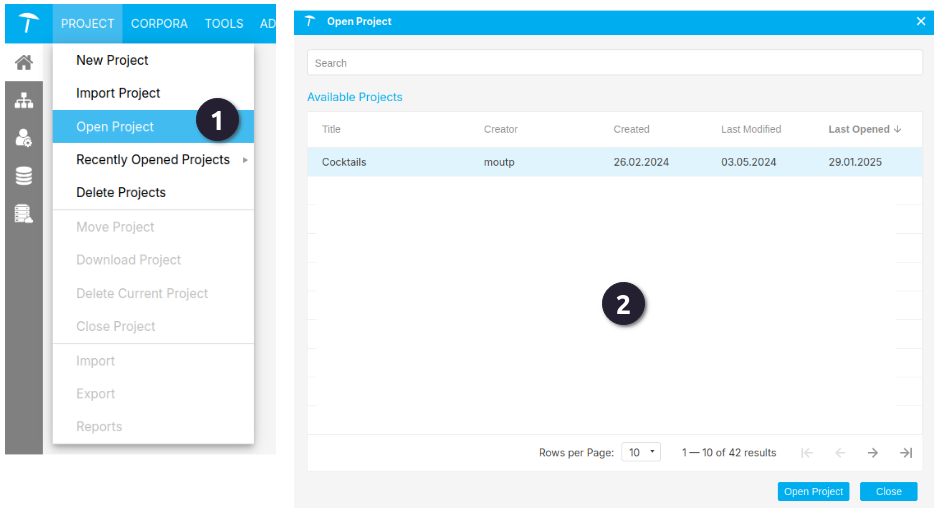
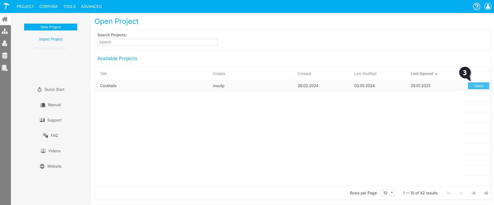

{: .no_toc .text-delta }

<!-- Overlay (only once) -->

  
  

## De PoolParty startscherm

Na het inloggen in PoolParty kom je terecht op het PoolParty Dashboard. Dit is het centrale startpunt van de applicatie. Het dashboard bestaat uit:

 **Het Hoofdmenu** 

Dit menu bevat de opties voor alle belangrijke functies en instellingen van PoolParty. Ook vind je hier algemene opties zoals je profielinstellingen, notificaties en – afhankelijk van de configuratie – een zoekfunctie.

Voor een uitgebreide uitleg over de betekenis van alle menu-opties, kun je terecht bij de volgende documentatie: [PoolParty's Main Menu](https://help.poolparty.biz/en/poolparty-overview/poolparty-s-user-interface/poolparty-s-toolbar/poolparty-s-main-menu.html).

{: .important }
> Goed om te weten: na de eerste keer inloggen en het openen van een project zie je als gebruiker een aangepast startscherm (zie afbeelding 1). Hier vind je onder andere een lijst van de projecten waartoe je toegang hebt.

 **De Werkbalk.**

Dit submenu bevat, afhankelijk van je rechten, een link naar je gebruikersprofiel en andere onderdelen, zoals de ontologiemanager.

 **De navigatiebalk aan de linkerkant.**

En de pictogrammen tonen links die je verder kunnen helpen, zoals de online PoolParty-handleiding, onze servicedesk of het PoolParty-video-kanaal. 

 **Contactinformatie**

Onderaan vind je de contactinformatie. Vanuit het RCE, kun je contact opnemen met [thesauri@cultureelerfgoed.nl](mailto:thesauri@cultureelerfgoed.nl)

 **Lijst met projecten waartoe de gebruiker toegang heeft.**

Afbeelding 1. Startscherm

---

## Een project openen

{: .important }
> Let op: binnen de RCE worden geen rechten verleend om zelf projecten aan te maken. Dit stelt ons in staat om de omgeving beter te beheren.
> Wanneer projecten door gebruikers zelf worden aangemaakt, verliezen wij het overzicht van welke projecten daadwerkelijk in gebruik zijn en welke slechts als test of experiment zijn aangemaakt.
> Wil je een nieuw project aanmaken? Neem dan contact met ons op. 

Omdat we vanuit het RCE een projectomgeving opzetten voor onze gebruikers, is het niet nodig om de stappen te doorlopen voor een project aanmaken. Als je nieuwsgierig bent hoe dat gebeurt dan verwijzen we je naar de officiele PoolParty handleiding: [Create a Thesaurus Project](https://help.poolparty.biz/en/poolparty-quick-start-guides/poolparty---quick-start-guide/create-a-thesaurus-project.html), en de iets uitgebreider [Creating Projects](https://help.poolparty.biz/en/user-guide-for-knowledge-engineers/basic-features/working-with-poolparty-projects---overview/creating-projects.html).

Een project openen kan op 3 manieren: 
 Door in het hoofdmenu op **Project** en vervolgens op  **Open Project** te klikken komt er een keuzemenu ter voorschijn waar gekozen kan worden voor een project.

 In het startmenu kun je ook of dubbelklikken met linkedmuis op een project of op de blauwe knop **Open** rechtermuis klikken.

