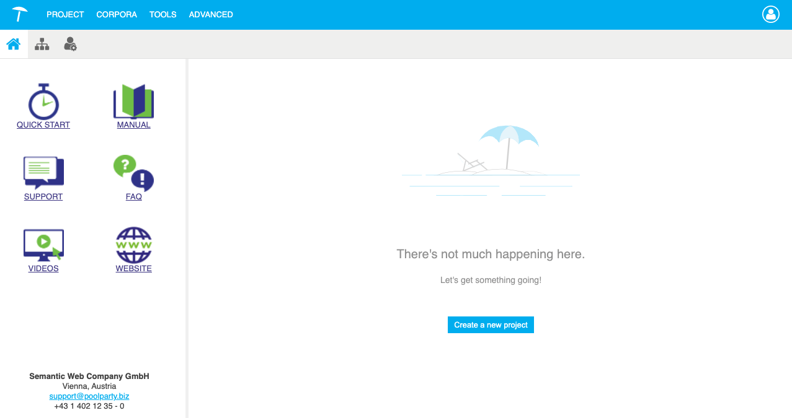

{: .no_toc .text-delta }

## De PoolParty startscherm

Na het inloggen in PoolParty zie je het PoolParty Dashboard:
1. Bovenaan vind je het Hoofdmenu.
2. En de Werkbalk.
3. De navigatie aan de linkerkant.
4. En de pictogrammen tonen links die je verder kunnen helpen, zoals de online PoolParty-handleiding, onze servicedesk of het PoolParty-video-kanaal. Onderaan vind je de contactinformatie .

    

## Project Aanmaken

{: .important }
> Let op: binnen de RCE worden geen rechten verleend om zelf projecten aan te maken. Dit stelt ons in staat om de omgeving beter te beheren.
> Wanneer projecten door gebruikers zelf worden aangemaakt, verliezen wij het overzicht van welke projecten daadwerkelijk in gebruik zijn en welke slechts als test of experiment zijn aangemaakt.
> Wil je een nieuw project aanmaken? Neem dan contact met ons op. Dit proces is opgenomen in de handleiding, zodat gebruikers beter inzicht hebben in wat er gebeurt.

## De PoolParty omgeving

