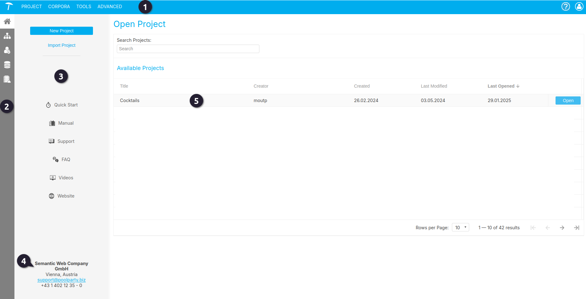
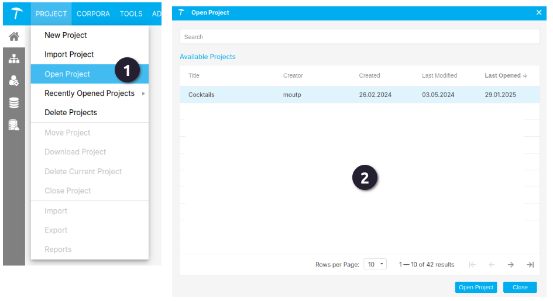
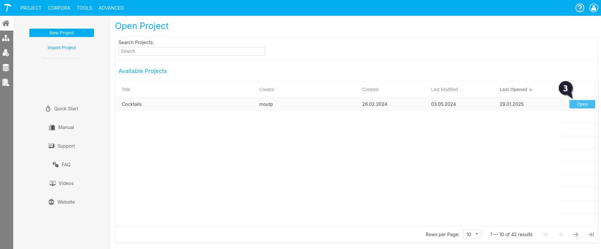

{: .no_toc .text-delta }

<!-- Overlay (only once) -->

  
  

# De PoolParty omgeving

Om aan de slag te gaan in PoolParty, moet je eerst een project openen. Binnen de RCE worden projecten voor je aangemaakt, en je hebt alleen toegang tot de projecten waarvoor je rechten hebt. Er zijn drie manieren om een project te openen, afhankelijk van je voorkeur. Hieronder leggen we uit hoe je dit eenvoudig kunt doen. 

## De PoolParty startscherm

Na het inloggen in PoolParty kom je op het PoolParty Dashboard, het centrale startpunt van de applicatie. Het dashboard bestaat uit:

 **Het Hoofdmenu** 

Dit menu bevat opties voor alle belangrijke functies en instellingen van PoolParty. Daarnaast vind je hier algemene opties zoals je profielinstellingen, notificaties en, afhankelijk van de configuratie, een zoekfunctie.

Voor een uitgebreide uitleg over de betekenis van alle menu-opties kun je de volgende documentatie raadplegen: [PoolParty's Main Menu](https://help.poolparty.biz/en/poolparty-overview/poolparty-s-user-interface/poolparty-s-toolbar/poolparty-s-main-menu.html).

{: .important }
> Goed om te weten: Na je eerste inlog en het openen van een project zie je als gebruiker een aangepast startscherm (zie afbeelding 1). Hier vind je onder andere een lijst met de projecten waartoe je toegang hebt.

 **De Werkbalk.**

Dit submenu bevat, afhankelijk van je rechten, een link naar je gebruikersprofiel en andere onderdelen, zoals de ontologiemanager.

 **De navigatiebalk aan de linkerkant.**

De pictogrammen in deze balk bieden links naar handige bronnen, zoals de online PoolParty-handleiding, de servicedesk en het PoolParty-videokanaal.

 **Contactinformatie**

Onderaan vind je de contactinformatie. Vanuit de RCE kun je contact opnemen met [thesauri@cultureelerfgoed.nl](mailto:thesauri@cultureelerfgoed.nl)

 **Lijst met projecten waarvoor de gebruiker toegangsrechten heeft.**

Afbeelding 1. Startscherm

---

## Een project openen

{: .important }
> Let op: Binnen de RCE worden geen rechten verleend om zelf projecten aan te maken. Dit zorgt voor een beter beheer van de omgeving.
> Wanneer gebruikers zelf projecten aanmaken, verliezen wij het overzicht van welke projecten daadwerkelijk in gebruik zijn en welke slechts als test of experiment zijn aangemaakt.
> Wil je een nieuw project laten aanmaken? Neem dan contact met ons op.

Omdat we vanuit de RCE een projectomgeving opzetten voor onze gebruikers, is het niet nodig om de stappen voor het aanmaken van een project te doorlopen. Ben je benieuwd hoe dit werkt? Dan verwijzen we je naar de officiële PoolParty-handleiding: [Create a Thesaurus Project](https://help.poolparty.biz/en/poolparty-quick-start-guides/poolparty---quick-start-guide/create-a-thesaurus-project.html), en de iets uitgebreider [Creating Projects](https://help.poolparty.biz/en/user-guide-for-knowledge-engineers/basic-features/working-with-poolparty-projects---overview/creating-projects.html).

Een project openen kan op drie manieren:  
 Door in het hoofdmenu op **Project** en vervolgens op  **Open Project** te klikken, verschijnt een keuzemenu waarin je een project kunt selecteren.

 In het startmenu kun je ook een project openen door:
- Er dubbel op te klikken met de linkermuisknop.  
- Met de rechtermuisknop op het project te klikken en vervolgens op de blauwe knop **Open** te kiezen.

