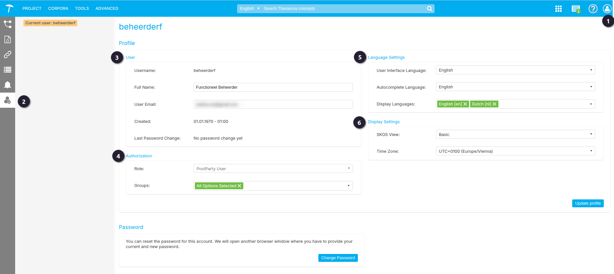

{: .no_toc .text-delta }

<!-- Overlay (only once) -->

  
  

# User management

In PoolParty is het mogelijk voor ieder gebruiker om zijn eigen account setting te bekijken en wijzigen. Afhankelijk van het rol dat de gebruiker heeft kan de functionaliteiten verschillen. Een Super Admin zal in staat zijn om alle rollen te beheren, en raden we aan bij accountproblemen met de beheerder contact op te nemen.

Het is op twee manieren mogelijk om te navigeren naar de User Management pagina.  

 Rechtssboven is een persoonsicon waarbij de opties `settings` naar de User Management pagina zal brengen.   
 Een andere optie is aan de linkedbalk waar ook een persoonsicon te vinden is.

Op de User Management pagina zijn er de settings voor `Profile`, `Authorization`, `Language Settings`, `Display Settings` en `Password`.  

 `Profile`  
Op de Profile settings, kan de gebruikers zien met welke gebruikersnaam de betreffende account geregistreerd is. Dit is niet iets wat de gebruiker kan veranderen. Vanuit RCE hanteren we de volgende afspraak om een gebruikersnaam aan te maken: achternaam + voorletter is kleine letters. 
Verder kan de gebruiker zijn volledig naam zien en aanpassen; of de email waar de account aan gekoppeld is veranderen.  

 `Authorization`
- Role: Op de Authorization gedeelte is het mogelijk om te zien welke rol de gebruiker toegekend is, en tot welke groepen de gebruiker behoort. 
- Groups: Groepen geven de gebruiker de mogelijkheid om een Thesaurus te bewerken waarbij dat groep toe behoort. Als de gebruiker tot meerdere groepen behoort kan er indien nodig aan en afgevinkt worden welke groepen getoond worden. Het toekennen tot een groep moet echter door een beheerder gedaan worden.  

 `Language Settings` 
- User interface Language: geeft de gebruiker de mogelijkheid om de taal van de gehele applicatie te veranderen. Momenteel worden er alleen `Duits`, `Engels`, `Frans` en `Slovenisch` ondersteund.  
- Autocomplete language: de taal die standaard wordt gebruikt of geselecteerd in velden met de functie voor automatisch aanvullen. Als de hier ingestelde taal niet beschikbaar is in het betreffende project, gebruikt PoolParty de standaardtaal van het project.  
- Display languages: talen die standaard zijn aangevinkt in de Detailweergave van de thesaurus van het project. Selecteer de talen die regelmatig worden bewerkt, zodat de gebruiker niet elke taal handmatig hoeft aan te vinken. Als de hier ingestelde talen niet beschikbaar zijn in het betreffende project, gebruikt PoolParty de standaardtaal van het project.  

 `Display Settings` 
- SKOS View: de weergave die is ingesteld voor het SKOS-tabblad in de Detailweergave van een concept. Voor meer informatie, zie Conceptdetails. Mogelijke opties: Basis en Geavanceerd.  
- Time Zone: de tijdzone die standaard is geselecteerd in de datum/tijd-aangepaste schema-attributen die de gebruiker toewijst aan concepten.  

{: .important }
> Om veranderingen door te voeren zal je eerst moeten uitloggen en weer inloggen.

Figuur 1. User Management pagina.

---

## Rollen
In PoolParty bestaan ​​de volgende rollen:

`PoolPartyReadOnly`  
Met deze rol kunt u inloggen bij PoolParty en projecten openen met alleen-lezen toegang.

`PoolPartyUser`  
Dit is de standaard gebruikersrol in PoolParty waarmee gebruikers kunnen inloggen bij
PoolParty en projecten kunnen openen en bewerken.

`PoolPartyAdmin`
Met deze rol kunt u naast de PoolPartyUser-rol projecten voor de toegewezen groepen
aanmaken en verwijderen en krijgen gebruikers toegang tot het menu Geavanceerd, waar
verschillende geavanceerde configuratiefuncties beschikbaar zijn. U hebt ook de rol
PoolPartyAdmin nodig om toegang te krijgen tot Ontologiebeheer en ontologieën en
aangepaste schema&#39;s te maken en te bewerken.

`PoolPartySuperAdmin`
Met deze rol heb je naast de PoolPartyAdmin-rol toegang tot het Gebruikersbeheer en het
Snapshot Dashboard.

`WikiEditor`
Deze rol geeft alleen toegang tot de Wiki-frontend van een project. Gebruikers met deze rol
kunnen niet inloggen bij PoolParty.

`ApiUser`
Met deze gebruikersrol is lees- en schrijftoegang tot de PoolParty API mogelijk. Gebruikers
met deze rol kunnen niet inloggen bij PoolParty.

`ApiAdmin`
Naast de rechten die ApiUsers hebben, kunnen gebruikers met deze rol bijvoorbeeld
ontologieën maken en wijzigen, projecten verwijderen en aanmaken en snapshots maken,
verwijderen en herstellen. Gebruikers met deze rol kunnen niet inloggen bij PoolParty.

`None`
Afhankelijk van de configuratie kan deze rol automatisch worden toegewezen aan
gebruikers die worden beheerd door een LDAP IDP. Gebruikers met deze rol kunnen
PoolParty niet gebruiken.

---

Voor verder verdieping zie ook de officiele PoolParty handleiding: 
- Zie ook [User Administration](https://help.poolparty.biz/pp2024r1/en/user-guide-for-knowledge-engineers/basic-features/poolparty-access-management/user-management/user-administration.html) 

- [User Roles in PoolParty](https://help.poolparty.biz/pp2024r1/en/user-guide-for-knowledge-engineers/basic-features/poolparty-access-management/user-rights-management/user-roles-in-poolparty.html)