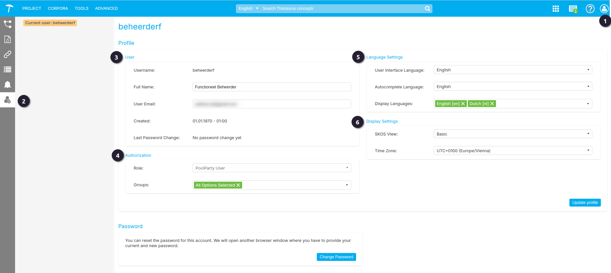

{: .no_toc .text-delta }

<!-- Overlay (only once) -->

  
  

# User Management in PoolParty

In PoolParty kunnen gebruikers verschillende rollen en rechten hebben, afhankelijk van hun taken en verantwoordelijkheden. Dit hoofdstuk behandelt de beschikbare gebruikersrollen en hun bijbehorende rechten. Daarnaast wordt uitgelegd hoe je jouw accountinstellingen beheert en waar je terecht kunt voor verdere ondersteuning.

Figuur 1. User Management pagina.

In PoolParty kan elke gebruiker zijn eigen accountinstellingen bekijken en wijzigen. Afhankelijk van de rol van de gebruiker kunnen de beschikbare functionaliteiten verschillen. Een **Super Admin** heeft de bevoegdheid om alle rollen te beheren. Bij accountproblemen raden we aan om contact op te nemen met de RCE PoolParty beheerders.

Er zijn twee manieren om naar de **User Management**-pagina te navigeren. 

 Rechtsboven bevindt zich een persoonsicoon. Door hierop te klikken en de optie **Settings** te selecteren, ga je naar de **User Management**-pagina.  
 Een andere optie is de navigatiebalk aan de linkerkant, waar je eveneens een persoonsicoon vindt. Ook door hierop te klikken, ga je naar de **User Management**-pagina.

Op de **User Management**-pagina vind je instellingen voor:  

- **Profile**  
- **Authorization**  
- **Language Settings**  
- **Display Settings**  
- **Password**   

 `Profile`  
In de **Profile Settings** kan de gebruiker zien met welke gebruikersnaam het account is geregistreerd. Dit is niet iets wat de gebruiker zelf kan wijzigen.  

Binnen de RCE hanteren we de volgende afspraak voor het aanmaken van een gebruikersnaam: **achternaam + voorletter** in kleine letters.  

Daarnaast kan de gebruiker:  
- De volledige naam bekijken en aanpassen.  
- Het e-mailadres wijzigen waaraan het account is gekoppeld.

 `Authorization`

- **Role:** In het **Authorization**-gedeelte kan de gebruiker zien welke rol is toegekend en tot welke groepen hij of zij behoort.  
- **Groups:** Groepen bepalen welke thesauri een gebruiker kan bewerken. Toegang tot een groep moet door een beheerder worden toegekend.

 `Language Settings` 
- **User Interface Language:** Hiermee kan de gebruiker de taal van de gehele applicatie wijzigen. Momenteel worden alleen **Duits, Engels, Frans** en **Sloveens** ondersteund.  
- **Autocomplete Language:** De taal die standaard wordt gebruikt in velden met de functie voor automatisch aanvullen. Als de ingestelde taal niet beschikbaar is in het project, gebruikt PoolParty de standaardtaal van het project.  
- **Display Languages:** De talen die standaard zijn aangevinkt in de **Detailweergave** van de thesaurus binnen het project. Door hier talen te selecteren die regelmatig worden bewerkt, hoeft de gebruiker niet telkens handmatig een taal aan te vinken. Als een geselecteerde taal niet beschikbaar is in het project, gebruikt PoolParty de standaardtaal van het project.

 `Display Settings` 
- **SKOS View:** Bepaalt de weergave van het **SKOS-tabblad** in de **Detailweergave** van een concept. Mogelijke opties: **Basis** en **Geavanceerd**. Voor meer informatie, zie **Conceptdetails**.  
- **Time Zone:** De standaard geselecteerde tijdzone voor datum-/tijd-aangepaste schema-attributen die de gebruiker aan concepten toewijst.

{: .important }
> Let op: Om wijzigingen door te voeren, moet je eerst uitloggen en vervolgens opnieuw inloggen.

---

## Rollen
In PoolParty bestaan ​​de volgende rollen:

`PoolPartyReadOnly`  
Met deze rol kun je inloggen bij PoolParty en projecten openen met **alleen-lezen toegang**.

`PoolPartyUser`  
Dit is de standaard gebruikersrol in PoolParty, waarmee gebruikers kunnen inloggen, projecten openen en bewerken.

`PoolPartyAdmin`
Met deze rol kun je, naast de **PoolPartyUser**-rol, projecten aanmaken en verwijderen voor de toegewezen groepen. Daarnaast krijgen gebruikers toegang tot het menu **Geavanceerd**, waar verschillende geavanceerde configuratiefuncties beschikbaar zijn.

`PoolPartySuperAdmin`
Deze rol wordt expliciet toegekend aan de **RCE PoolParty-beheerders**. Naast de **PoolPartyAdmin**-rol biedt deze rol toegang tot **Gebruikersbeheer** en het **Snapshot Dashboard**. Daarnaast kun je **Ontologiebeheer** gebruiken om ontologieën en aangepaste schema’s te maken en te bewerken.

`WikiEditor`
Deze rol geeft alleen toegang tot de **Wiki-frontend** van een project. Gebruikers met deze rol kunnen **niet** inloggen bij PoolParty.

`ApiUser`
Met deze rol is **lees- en schrijftoegang** tot de **PoolParty API** mogelijk. Gebruikers met deze rol kunnen **niet** inloggen bij PoolParty.

`ApiAdmin`
Naast de rechten van **ApiUser**, kunnen gebruikers met deze rol onder andere **ontologieën maken en wijzigen, projecten aanmaken en verwijderen**, en **snapshots maken, verwijderen en herstellen**. Gebruikers met deze rol kunnen **niet** inloggen bij PoolParty.

`None`
Afhankelijk van de configuratie kan deze rol automatisch worden toegewezen aan
gebruikers die worden beheerd door een LDAP IDP. Gebruikers met deze rol kunnen
PoolParty niet gebruiken.

---

Voor meer verdieping raadpleeg de **officiële PoolParty-handleiding**:
- [User Administration](https://help.poolparty.biz/pp2024r1/en/user-guide-for-knowledge-engineers/basic-features/poolparty-access-management/user-management/user-administration.html) 

- [User Roles in PoolParty](https://help.poolparty.biz/pp2024r1/en/user-guide-for-knowledge-engineers/basic-features/poolparty-access-management/user-rights-management/user-roles-in-poolparty.html)