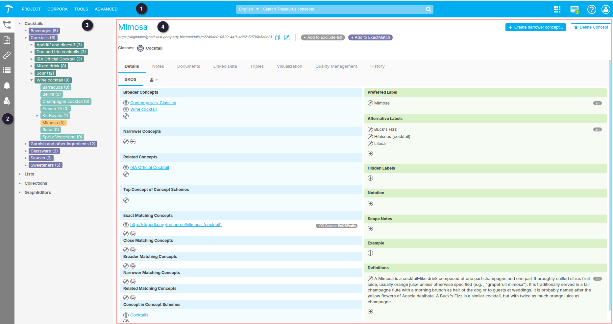

{: .no_toc .text-delta }

<!-- Overlay (only once) -->

  
  

# De PoolParty Project Layout

De project layout hangt af van de gebruikersrol en ook van een aantal settings zoals `SKOS view` en `Groups`.  
De volgende beschrijving van de layout is gedaan met de rol `PoolParty User` met `SKOS view = Advanced` in de [User Management]() settings.

Figuur 1. Project Layout.

 Het Hoofdmenu  
 De Werkbalk  

De betekenis van de iconen in zowel het hoofdmenu als de werkbalk worden verder uiteengezet in [PoolParty's Toolbar]().  

 Hier is de Thesaurus weergegeven in een boom weergave die in [Anatomie van een SKOS Thesaurus]() verder wordt uiteengezet.  
 