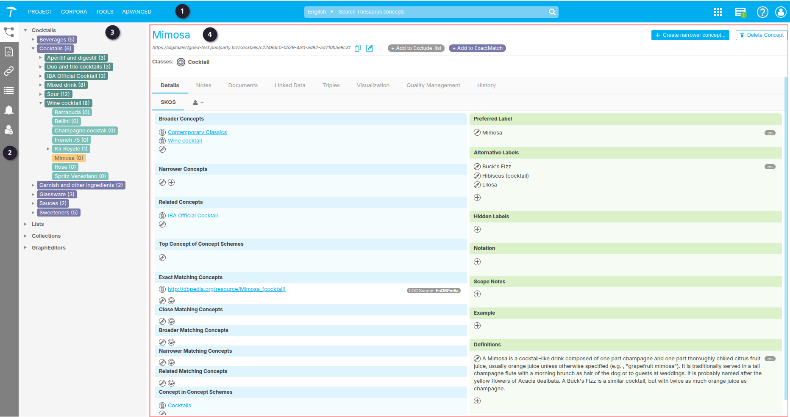

{: .no_toc .text-delta }

<!-- Overlay (only once) -->

  
  

# De PoolParty Project Layout  

De projectlayout in PoolParty biedt een overzichtelijke manier om thesauri te beheren en te navigeren. Afhankelijk van je gebruikersrol en instellingen, zoals `SKOS view` en `Groups`, kunnen bepaalde functies en weergaven beschikbaar zijn of verschillen.  

In dit hoofdstuk wordt de structuur van de projectomgeving uitgelegd, inclusief de belangrijkste onderdelen en iconen. Daarnaast wordt er verwezen naar aanvullende documentatie voor een diepgaandere uitleg van specifieke functies.

De volgende beschrijving van de layout is gebaseerd op een gebruiker met de rol `PoolParty User`, waarbij `SKOS view = Advanced` is ingesteld in de [User Management]() settings.

Figuur 1. Project Layout.

 Het Hoofdmenu  
 De Werkbalk  

De betekenis van de iconen in zowel het hoofdmenu als de werkbalk wordt verder uiteengezet in [PoolParty's Toolbar]().

 Hier wordt de Thesaurus weergegeven in een boomweergave, die verder wordt toegelicht in [Anatomie van een SKOS Thesaurus]().  
 