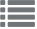

{: .no_toc .text-delta }

<!-- Overlay (only once) -->

  
  

# PoolParty Toolbar

De PoolParty-werkbalk is verdeeld in verschillende groepen met pictogrammen:

- Standaard werkbalkpictogrammen zijn aanvankelijk zichtbaar wanneer u PoolParty start.  
- Projectafhankelijke pictogrammen worden zichtbaar nadat u een project heeft geopend. Daarnaast zijn deze afhankelijk van de PoolParty-modules die u mogelijk heeft aangeschaft.

Met behulp van de pictogrammen kunt u schakelen tussen de volgende functies:

**Default Icons (Initial State)**

 De standaardpictogrammen zijn altijd zichtbaar in deze volgorde wanneer u voor het eerst inlogt op PoolParty:

 Home (altijd actief bij het opstarten van PoolParty).

 Onlogy Management is de plek waar je een ontologie kunt maken en beheren die wordt gebruikt voor het creëren van een aangepast schema in een PoolParty-project. Zie ook: [Ontology Management](https://help.poolparty.biz/en/user-guide-for-knowledge-engineers/advanced-features/ontology-management.html)  

 PoolParty Access Management is waar een gebruiker kan inloggen, het profiel kan bijwerken en het wachtwoord kan wijzigen na accountactivatie. Zie ook [PoolParty Access Management](https://help.poolparty.biz/en/user-guide-for-knowledge-engineers/basic-features/poolparty-access-management.html)

 The Snapshot Dashboard biedt de mogelijkheid om zowel een back-up te maken als te herstellen voor een project of een systeemrepository. Het Snapshot-dashboard is de gebruikersinterface waarmee back-upbestanden beheerd kunnen worden, zoals het aanmaken, herstellen, downloaden of verwijderen ervan. Zie ook: [The Snapshot Dashboard](https://help.poolparty.biz/en/user-guide-for-knowledge-engineers/advanced-features/advanced-poolparty-configuration/the-snapshot-dashboard.html)

**Project-afhankelijk Icons**

 Thesaurus Management biedt handige functies voor thesaurusbeheerders om hun thesauri efficiënt te ontwikkelen en beheren. Zo kunnen relaties en concepten eenvoudig worden aangemaakt, verplaatst en samengevoegd via drag-and-drop. Daarnaast is het mogelijk om relaties toe te voegen met autocomplete, labels te vertalen in meertalige thesauri en notities aan concepten toe te voegen. Met DBpedia-autocomplete kunnen nieuwe concepten worden gemaakt, en de weergave van de hiërarchieboom kan worden aangepast met labels en sortering. Zie [Managing Your Thesauri](https://help.poolparty.biz/en/user-guide-for-knowledge-engineers/basic-features/managing-your-thesauri.html)

 Corpus Management helpt bij het uitbreiden van thesauri met relevante termen die afkomstig zijn uit documenten binnen hetzelfde domein. Daarnaast worden corpora gebruikt om de entiteitherkenning te verbeteren door termen en concepten beter te scoren en schaduwconceptsuggesties te bieden op basis van co-occurrences. Ook is het mogelijk om een geheel nieuwe thesaurus te maken op basis van een corpus.. Zie ook [Corpus Management](https://help.poolparty.biz/en/user-guide-for-knowledge-engineers/advanced-features/corpus-management---overview.html)

 Project Linking Het aanmaken en beheren van gecontroleerde vocabulaires in bedrijven of organisaties gebeurt vaak gedistribueerd. In sommige gevallen is het beter om meerdere vocabulaires met verschillende informatie voor uiteenlopende doeleinden (zoals technisch of marketing) of domeinen in meerdere projecten te beheren, in plaats van alles in één centraal kennismodel onder te brengen.

Het werken met gedecentraliseerde vocabulaires leidt tot verschillende representaties en contexten van dezelfde concepten in diverse vocabulaires. Met projectkoppelingen in PoolParty kunnen organisaties vocabulaires in meerdere projecten beheren. Deze projecten kunnen bijvoorbeeld overeenkomen met afdelingsstructuren of verschillende domeinen (technisch vs. marketing). De koppelingen verbinden concepten die verschillende aspecten van dezelfde begrippen vertegenwoordigen en houden de verschillende onderdelen geïntegreerd.

Gebruik de linking project-functie van PoolParty om koppelingen te maken tussen overeenkomstige concepten in verschillende vocabulaires.. Zie ook [Project Linking](https://help.poolparty.biz/en/user-guide-for-knowledge-engineers/advanced-features/advanced-poolparty-configuration/linking-poolparty-projects.html)

{: .important }
> Project Linking is een proces in twee stappen: (1) projecten koppelen op projectniveau en (2) individuele concepten koppelen tussen de gekoppelde projecten.

 Workflow Dashboard biedt een overzicht van verschillende workflowgerelateerde aspecten bij het werken met de PoolParty Thesaurus Server.

----

