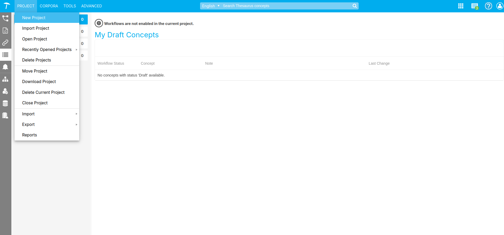

# Project aanmaken

{: .no_toc .text-delta }

{: .important }
> Let op, vanuit de RCE geven we geen rechten om dit zelf te doen. Dit omdat wij de omgeving dan beter kunnen beheren.
> Wanneer men zelf projecten aanmaakt, hebben wij het overzicht niet meer welke projecten er daadwerkelijk in gebruik zijn, en welke als probeersel zijn aangemaakt.
> Om een nieuw project aan te maken kun je het best contact met ons opnemen. 

## De PoolParty startscherm

Na het inloggen in PoolParty zie je het PoolParty Dashboard. Bovenaan vind je het Hoofdmenu (1) en de Werkbalk (2). De navigatie aan de linkerkant (3) en de pictogrammen tonen links die je verder kunnen helpen, zoals de online PoolParty-handleiding, onze servicedesk of het PoolParty-video-kanaal. Onderaan vind je de contactinformatie (4).

## Maak een Nieuwe Thesaurus Project Aan

    

