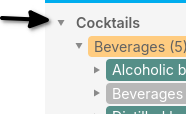
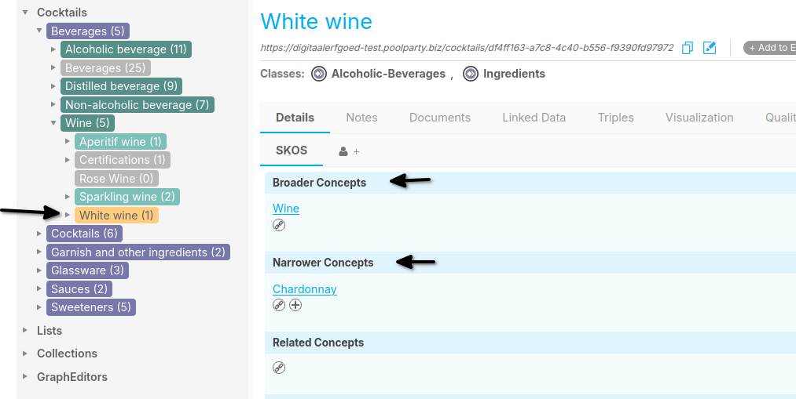
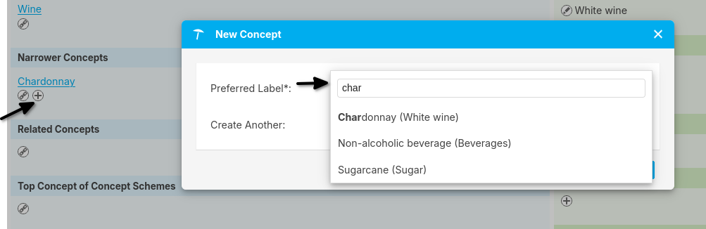
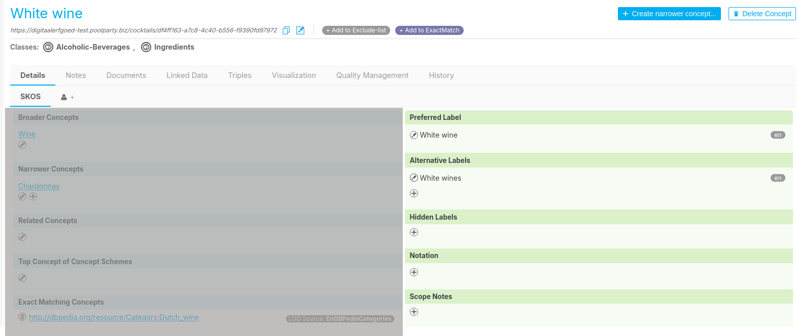
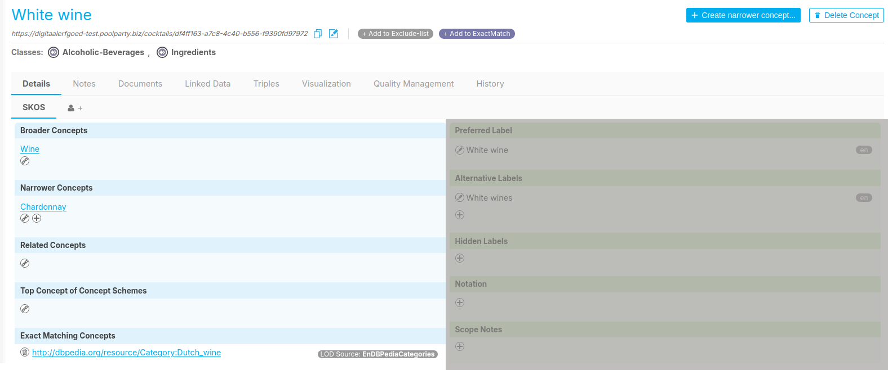

{: .no_toc .text-delta }

<!-- Overlay (only once) -->

  
  

# Anatomie van een SKOS Thesaurus  

Een **SKOS Thesaurus** is een gestructureerde verzameling termen die worden gebruikt om concepten en hun onderlinge relaties te beschrijven. In PoolParty wordt **SKOS (Simple Knowledge Organization System)** toegepast om semantische structuren op te bouwen en kennis efficiënt te organiseren.  

De **PoolParty Semantic Suite** is ontwikkeld met als belangrijkste doel dat gebruikers eenvoudig hun thesaurus kunnen beheren. De interface en weergaven zijn intuïtief ontworpen, zodat er **geen diepgaande semantische kennis** nodig is om aan de slag te gaan.  

In dit hoofdstuk worden de belangrijkste componenten van een **SKOS Thesaurus** behandeld en wordt uitgelegd hoe de **hiërarchische structuur** binnen PoolParty functioneert.  

## Hierarchische boom weergave

Afbeelding 1: Hierarische Boom weergave.

In **PoolParty** wordt aan de **linkerkant van het scherm** een overzicht weergegeven van het **project**, de **concept schemes** en de **concepten** in een **hiërarchisch diagram** [Afbeelding 1].  

Elke **node** in het diagram heeft een specifieke **kleur**, die aangeeft tot welk type deze behoort:

{: .important}
> **Goed om te weten:** In deze handleiding wordt de **Cocktails Thesaurus** als voorbeeld gebruikt.

###  Project
Een **project** kun je zien als de **container** waarin de projectonderdelen, zoals **thesauri en lijsten**, zijn opgenomen.  

Door op dit onderdeel te klikken, wordt een **gedetailleerd overzicht** van het project geopend, waar ook de **metadata** kan worden aangepast [Afbeelding 2].

Afbeelding 2: Project metadata weergave.

###  Concept scheme (Paars)
Een concept scheme is een structuur die concepten binnen een specifiek domein organiseert. Het definieert een hiërarchie of relaties tussen concepten, maar biedt niet altijd de rijkdom aan relaties die in een thesaurus te vinden is.

In PoolParty kun je concept schemes gebruiken als de bredere organisatorische structuur (bijvoorbeeld "Sauces") en binnen deze schema's thesauri opbouwen om rijkere relaties tussen termen te definiëren. Een concept Scheme zegt iets over een set termen, maar is zelf geen onderdeel van de thesaurus.
Een concept scheme kan meerdere top-concepten en concepten bevatten en geeft de hierarische relatie tussen deze concepten weer. 

{: .important }
> **Goed om te weten:** Achter elke **concept scheme** of **term** staat tussen haakjes het aantal termen dat er direct onder valt.

###  Top concepten / top termen (Donker groen) 
**Topconcepten** / **top termen** worden weergegeven in donker groen. Deze concepten bevinden zich op het eerste niveau onder een concept scheme en hebben subconcepten onder zich. Een topconcept heeft een *narrower*-relatie met de subconcepten, terwijl de subconcepten op hun beurt een *broader*-relatie met het topconcept hebben.

###  Concepten (groen)
Concepten hebben een *broader*-relatie met een topconcept, maar kunnen ook subconcepten en daar weer onderligende subconcepten hebben.

---

## Termen invoeren en wijzigen  

**Toptermen** en **termen** kunnen worden toegevoegd en gewijzigd.  

- Je kunt **gericht zoeken** naar een term door deze in te voeren in het **zoekvak**.  

- Je kunt ook door de **thesaurus bladeren** door termen uit te klappen met de **pijltjesknoppen** naast de termen.  

- Als een term **geen Narrower termen** heeft, wordt er **geen pijltje** links naast de term weergegeven.  

## Term aan andere termen koppelen  

Wanneer je een **term** aanklikt (selecteert), wordt deze **geel** gemarkeerd. De gegevens over de term verschijnen in het **rechterscherm**.  

Je kunt een **Broader** of **Narrower** term toevoegen door in het vakje **NARROWER** of **BROADER** op het  **kettinkje** te klikken.  

In het opzoekscherm dat verschijnt, kun je de juiste term selecteren met behulp van **Auto Complete**.  
Daarnaast kun je de gewenste term ook **vanuit het linkerscherm naar het juiste vak in het rechterscherm slepen**.  

## Indeling scherm van een Term  

In het **rechterscherm** staan de velden waarmee je een **term** kunt documenteren.  
- In het **rechterdeel van het scherm** (*groen*) kan een term beschreven worden met de datatype properties zoals labels, teksten en links.

 

- In het **linkerdeel van het scherm** (*blauw*) kan een term relationeel verrijkt worden met oobjecttype properties zoals `skos:broader`, `skos:narrower`, `skos:exactMatch`.

**Labels en teksten** kunnen aan een **term** worden toegevoegd door op het  **plusteken** aan de linkerkant te klikken voor onder andere `skos:prefLabel`, `skos:altLabel` en `skos:scopeNote`.  

- `skos:altLabel` kan worden **omgewisseld** met `skos:prefLabel` door op de knop met **omwisselpijltjes** aan de rechterkant te klikken.  
- Ingevoerde teksten en labels kunnen worden **gewijzigd** door op het  **pennetje** links van de tekst te klikken.  
- Labels en teksten kunnen worden  **verwijderd** door op de **"x"** aan de linkerkant te klikken.  
- Alle termen en teksten kunnen zowel in het **Nederlands** als in de **extra taal** die is gekozen voor de thesaurus worden toegevoegd.  

{: .important }
> **Let op:** **Definitions** en **Scope Notes** kunnen lange teksten bevatten, maar er mogen **geen bijzondere tekens** of **nieuwe alinea’s** worden gebruikt bij het invoeren van teksten.  
> Zodra je een bijzonder teken of een **harde return** invoert, kleurt het tekstvak **rood** als waarschuwing.

---

## Zie ook

- [SKOS and PoolParty](https://help.poolparty.biz/en/poolparty-overview/poolparty,-skos,-rdf-and-uris/skos-and-poolparty.html)
- [Building a Taxonomy With PoolParty](https://www.youtube.com/watch?v=6yffynGig8k)
- [Editing Details](https://help.poolparty.biz/en/user-guide-for-knowledge-engineers/basic-features/working-with-concept-schemes-and-concepts/editing-details.html)

---

