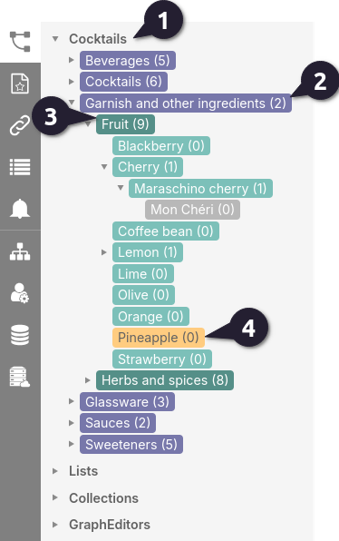
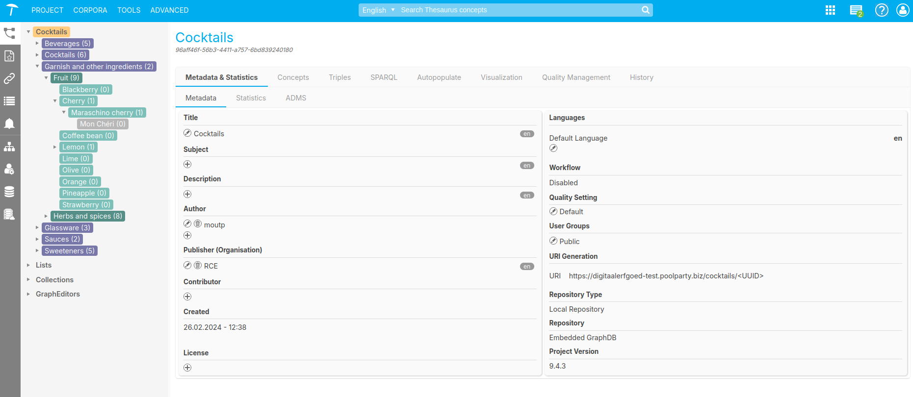

{: .no_toc .text-delta }

<!-- Overlay (only once) -->

  
  

# Anatomie van een SKOS thesaurus 

De PoolParty-software is ontwikkeld met als belangrijkste doel dat gebruikers eenvoudig hun thesaurus kunnen beheren. Daardoor zijn veel weergaves intuitief ontwikkeld zodat er niet veel semantische kennis nodig is om te starten. Hieronder wordt de werking van de hierarchische structuur van een SKOS thesaurus uiteengezet.

### Hierarchische boom weergave

Afbeelding 1: Hierarische Boom weergave.

In Poolparty kun je aan de linkerzijde in het scherm de project, concept schemes en concepten overzicht weergegeven in een hiërarchisch diagram [Afbeelding 1].
Elke node in het diagram wordt aangeduid met een kleur die specifiek is voor het type:

{: .important}
> Goed om te weten: In het gehele handleiding wordt de **Cocktails thesaurus** gebruikt als voorbeeld. 

### **1** Project
Een project kun je zien als de container waarin de projectonderdelen (zoals thesauri en lijsten) zijn opgenomen. Door op dit onderdeel te klikken, wordt een gedetailleerd overzicht van het project geopend, waar ook de metadata kan worden aangepast [Afbeelding 2].

Afbeelding 2: Project metadata weergave.

### **2** Concept scheme (Paars)
Een concept scheme is een structuur die concepten binnen een specifiek domein organiseert. Het definieert een hiërarchie of relaties tussen concepten, maar biedt niet altijd de rijkdom aan relaties die in een thesaurus te vinden is.

In PoolParty kun je concept schemes gebruiken als de bredere organisatorische structuur (bijvoorbeeld "Sauces") en binnen deze schema's thesauri opbouwen om rijkere relaties tussen termen te definiëren. Een concept Scheme zegt iets over een set termen, maar is zelf geen onderdeel van de thesaurus.
Een concept scheme kan meerdere top-concepten en concepten bevatten en geeft de hierarische relatie tussen deze concepten weer. 

{: .important }
> Goed om te weten: achter elke concept scheme of term staat tussen haakje hoeveel termen direct onder liggen.

### **3** Top concepten / top termen (Donker groen) 
**Topconcepten** / **top termen** worden weergegeven in donker groen. Deze concepten bevinden zich op het eerste niveau onder een concept scheme en hebben subconcepten onder zich. Een topconcept heeft een *narrower*-relatie met de subconcepten, terwijl de subconcepten op hun beurt een *broader*-relatie met het topconcept hebben.

### **4** concepten (groen)
Concepten hebben een *broader*-relatie met een topconcept, maar kunnen ook subconcepten en daar weer onderligende subconcepten hebben.

---

## Termen invoeren en wijzigen
Toptermen en termen kunnen toegevoegd en gewijzigd worden.
Je kunt gericht op zoek naar een term door deze in het zoekvak in te voeren, links onder het parasolletje. Of je kunt door de thesaurus bladeren door termen uit te klappen met de pijltjesknoppen naast de termen. Als er geen narrower termen zijn dan staat er geen pijltje links naast de term.

## Term aan andere termen koppelen
Als je een term aanklikt (selecteert) dan wordt de term geel. De gegevens over de term verschijnen in het rechterscherm.
Je kunt een broader of een narrower term aan je term toevoegen door in het vakje NARROWER of BROADER op het kettinkje te klikken.

In het opzoekscherm dat je dan krijgt kun je de juiste term selecteren met behulp van Auto
Complete. Of je kunt de gewenste term uit het linkerscherm naar het juiste vak in het rechterscherm te slepen.

## Indeling scherm van Term
In het rechterscherm staan de velden waarmee je een term kunt documenteren. Linksboven kun je Broader, Narrower en Related Termen vastleggen. In het Rechter deel van het scherm (lichtgroen) ga je de term beschrijven.

Labels en teksten kunnen aan een term toegevoegd worden door op het plusteken aan de linkerkant te klikken.
Ingevoerde teksten en labels kunnen gewijzigd worden door op het Pennetje, links van de tekst, te klikken.

Labels en teksten kunnen verwijderd worden door op de “x” aan de linkerkant te klikken. Alternative Labels kunnen met Preferred labels omgewisseld worden door op de knop met
Omwisselpijltjes aan de rechterkant te klikken.
Alle termen en teksten kunnen zowel in het Nederlands als in het Engels ingevoerd worden.

{: .important }
> Definitions en scopenotes kunnen best lange teksten worden: maar er mogen geen
bijzondere tekens of nieuwe alinea ́s gebruikt worden bij het invoeren van teksten. Zo gauw
je een bijzonder teken of een harde return invoert kleurt het tekstvak rood.

---

## Zie ook

---

Bijdrage van: Let's Party! Thesaurus beheer met Poolparty Versie 1.3

---

