{: .no_toc .text-delta }

<!-- Overlay (only once) -->

  
  

# Corpora en Documenten

 De **Corpus Management**-functionaliteit in PoolParty ondersteunt het uitbreiden van een thesaurus met relevante termen uit documenten die inhoudelijk aansluiten bij het domein van de thesaurus. Daarnaast helpt een corpus bij het verbeteren van entity extraction, door een betere scoretoekenning aan termen en concepten, en door het aandragen van zogenoemde shadow concept suggestions op basis van co-occurrences.

Je kunt ook een geheel nieuwe thesaurus opbouwen, beginnend vanuit een corpus.

 Het corpus is toegankelijk via de tweede knop van boven in het linker navigatiemenu.   
 Een nieuwe Corpus kan aangemaakt worden met **linkermuisklik** op de **Corpora** node;  
 Of onder het tabblad **Create Corpus** in het rechterscherm kun je nieuwe documenten aan het corpus toevoegen.  

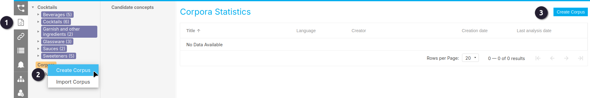

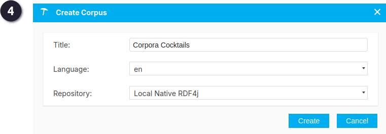

Bij het aanmaken van een corpus vul je de volgende velden in:

- **Title**: Voer een titel naar keuze in. Deze titel wordt gebruikt als naam van het corpus binnen het hele project, en verschijnt bijvoorbeeld in de **Hierarchy Tree**.

- **Language**: Kies de taal van de documenten in het corpus via het keuzemenu. De beschikbare talen zijn afhankelijk van de **Language Settings** van het project.

- **Repository**: Selecteer de opslaglocatie waar het corpus wordt bewaard. De standaard lokale opslag is **Embedded GraphDB**. GraphDB wordt meegeleverd als add-on module. Andere opties zijn afhankelijk van de PoolParty-configuratie via de **Semantic Middleware Configurator**.

{: .important }
> Let op! De documenten mogen niet groter dan 10 mb zijn.

### Create Corpus opties

#### Documenten uploaden naar een corpus
In het geopende dialoogvenster **Upload Documents** staat standaard het tabblad **Upload Documents** open.

- Klik op **Select Files** om bestanden van je lokale schijf te selecteren en toe te voegen aan het documentencorpus.

- **Enforce Corpus Language**: Als je dit selectievakje inschakelt, gebruikt PoolParty taalherkenning om documenten met een andere taal dan de tijdens het aanmaken opgegeven corpus-taal uit te filteren.

- Klik op **Upload** om het uploadproces te starten.

Tijdens het uploaden zie je een voortgangsbalk. Zodra het uploaden is voltooid, verschijnt er een melding met details over de uploadstatus.

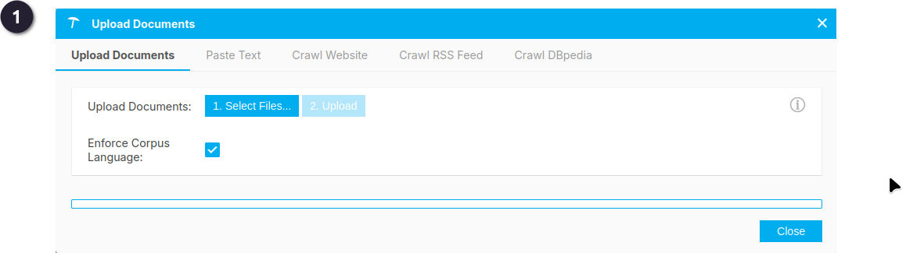

Zie ook: [Upload Documents From Your Local Drive](https://help.poolparty.biz/en/user-guide-for-knowledge-engineers/advanced-features/corpus-management---overview/upload-documents-to-a-corpus/upload-documents-from-your-local-drive.html)

#### Tekst plakken in een corpus

Selecteer het tabblad **Paste Text** in het dialoogvenster **Upload Documents**.

De volgende opties zijn hier beschikbaar:

- Vul een **titel** in het veld *Title* in om het document een naam te geven binnen het documentencorpus.

- Plak de gewenste tekst in het veld **Text**.

- **Enforce Corpus Language**: Als je dit selectievakje inschakelt, gebruikt PoolParty taalherkenning om teksten met een andere taal dan de tijdens het aanmaken opgegeven corpus-taal uit te filteren.

- Klik op **Submit** om de tekst toe te voegen aan het corpus.

Na voltooiing verschijnt er een melding met de status van de upload.   

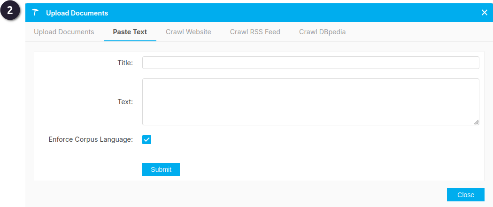

Zie ook: [Paste Text to Add It to Your Documents](https://help.poolparty.biz/en/user-guide-for-knowledge-engineers/advanced-features/corpus-management---overview/upload-documents-to-a-corpus/paste-text-to-add-it-to-your-documents.html)

#### URL’s gebruiken om documenten toe te voegen aan een corpus

Je kunt URL’s opgeven om documenten te creëren en toe te voegen aan je documentencorpus.

- Selecteer het tabblad **Crawl Website** in het dialoogvenster **Upload Documents**.

- Typ of plak de URL die PoolParty moet crawlen in het veld **Provide URL**.

Er zijn twee optionele instellingen:

- **Depth**: stel de diepte van het crawlproces in. Een diepte van '2' betekent dat PoolParty ook de pagina’s volgt die gelinkt zijn vanaf de opgegeven URL tot twee niveaus diep. *(Standaard: 1)*

- **Enforce Corpus Language**: als dit vinkje is ingeschakeld, crawlt PoolParty alleen pagina’s waarvan de taal overeenkomt met de corpus-taal die je bij het aanmaken hebt ingesteld. *(Standaard: ingeschakeld)*

- Klik op **Crawl** om het proces te starten.

De inhoud van de opgegeven website en de gekoppelde pagina’s wordt opgehaald en als losse bestanden opgeslagen in je corpus. Na afloop verschijnt een melding met de status van de upload.

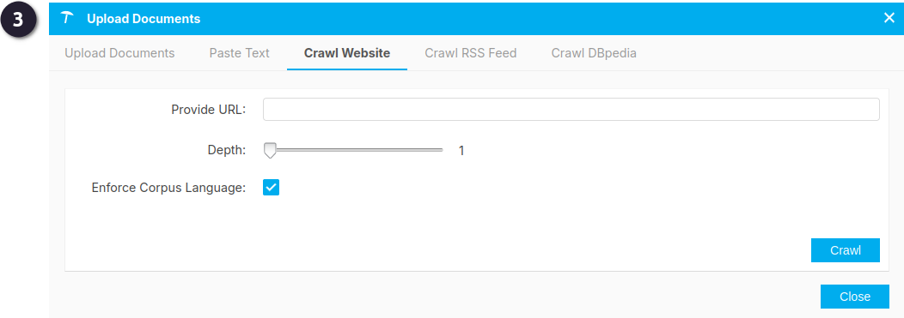

Zie ook: [Grab Documents From HTML Pages](https://help.poolparty.biz/en/user-guide-for-knowledge-engineers/advanced-features/corpus-management---overview/upload-documents-to-a-corpus/grab-documents-from-html-pages.html)

#### RSS-feeds gebruiken voor je corpus

Je kunt eenvoudig de inhoud van RSS-feeds gebruiken om documenten toe te voegen aan je corpus in PoolParty.

- Selecteer het tabblad **Crawl RSS Feed** in het dialoogvenster **Upload Documents**.

- Voer de URL van de RSS-feed in het veld **Provide URL** in.

- **Enforce Corpus Language**: schakel dit selectievakje in om PoolParty de taal van het corpus te laten aanhouden, ongeacht de taal van de feed. *(Standaard: ingeschakeld)*

- Klik op **Crawl** om het uploadproces te starten.

De inhoud van de opgegeven feed en de gekoppelde pagina’s wordt opgehaald en als bestanden opgeslagen in je corpus. Na afloop verschijnt een melding met de status van de upload.

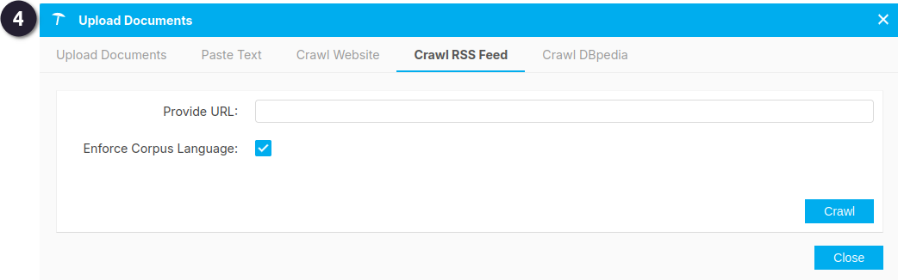

Zie ook: [Use an RSS Feed as Corpus Document Source](https://help.poolparty.biz/en/user-guide-for-knowledge-engineers/advanced-features/corpus-management---overview/upload-documents-to-a-corpus/use-an-rss-feed-as-corpus-document-source.html)

#### DBpedia gebruiken voor je corpus

- Selecteer het tabblad **Crawl DBpedia** in het dialoogvenster **Upload Documents**.

- Klik op **Crawl** om het uploadproces te starten.

De samenvattingen (*abstracts*) van de DBpedia-bronnen die gekoppeld zijn aan de concepten in je thesaurus worden opgehaald en als bestanden opgeslagen in je corpus. Na afloop verschijnt een melding met de status van de upload.

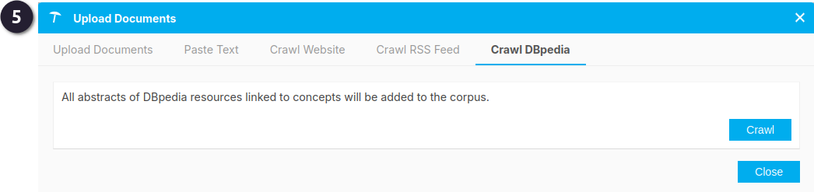

Zie ook: [Use DBpedia as Corpus Document Source](https://help.poolparty.biz/en/user-guide-for-knowledge-engineers/advanced-features/corpus-management---overview/upload-documents-to-a-corpus/use-dbpedia-as-corpus-document-source.html)

#### Voorbeeld Corpus toevoegen met DBPedia

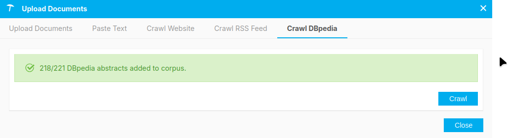

### Analyseren van de toegevoegde documenten

Als je een of meerdere documenten aan een corpus hebt toegevoegd dan dien je die documenten te analyseren. Dat doe je door in het Metadata tabblad op de knop **Recalculate Corpus Analysis** te klikken. Dit duurt een tijdje.

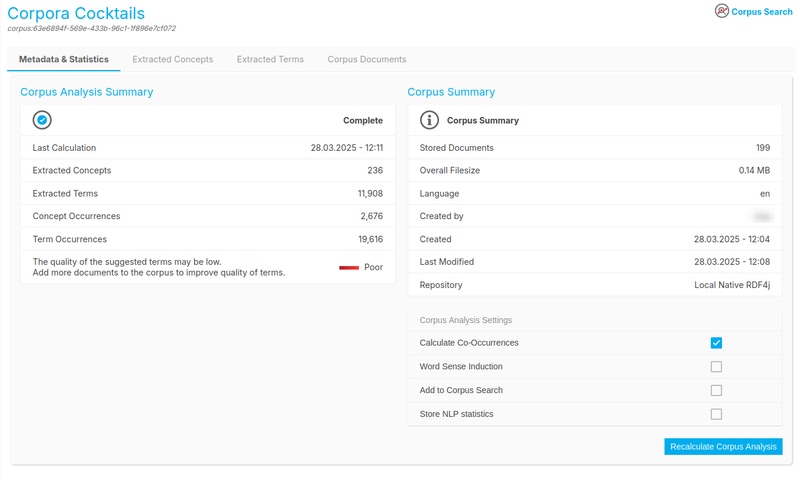

---

### Extracted Concepts

Op het tabblad **Extracted Concepts** kun je zien welke concepten uit je thesaurus in je corpus zijn teruggevonden.  
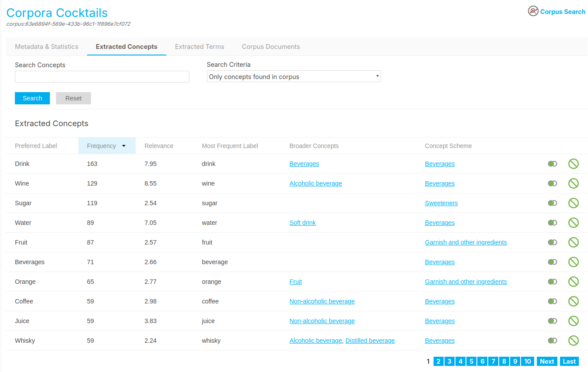

**Mogelijke opties**
- Gebruik **Search Concepts** om op concepten te filteren en klik op Search om de zoekopdracht te starten. Er verschijnt dan een lijst met resultaten. Klik op **Reset** om de volledige lijst weer te geven.  
- In de vervolgkeuzelijst **Search Criteria** kun je kiezen om te filteren op concepten die wel of niet in het corpus voorkomen.  
- Gebruik het pictogram **Show Matching Terms** om een lijst te tonen met geëxtraheerde termen die lijken op het betreffende concept. Dit helpt bij het herkennen van synoniemen (alternative labels) en nieuwe, specifiekere concepten die je met een paar klikken kunt toevoegen.  
- Met het pictogram Add to **Exclude-list** kun je een concept toevoegen aan de uitsluitlijst, zodat het niet meer in de extractieresultaten verschijnt.  

Zie ook [Extracted Concepts List](https://help.poolparty.biz/en/user-guide-for-knowledge-engineers/advanced-features/corpus-management---overview/analyse-documents-in-your-document-corpus/extracted-concepts-list.html)

**Tabelkolommen**

In het tabblad **Extracted Concepts** kun je de tabelkolommen gebruiken om te sorteren op **Preferred Label**, **Frequency** en **Most Frequent Label**.

De kolommen geven de volgende informatie weer:  
- Preferred Label: het label van het concept dat voorkomt in de thesaurus en is geëxtraheerd uit de corpusdocumenten.  
- Frequency: het totale aantal keren dat een concept is aangetroffen in de corpusdocumenten.  
- Relevance: toont de scores van concepten die tijdens de Corpus Analysis in het corpus zijn gevonden. Deze scores geven een indicatie van de waarde of relevantie van het concept. De berekening is vergelijkbaar met die van termen in de lijst Extracted Terms.
- Most Frequent Label: toont het label dat het vaakst voorkomt in de corpusdocumenten, bijvoorbeeld als onderdeel van een term of zin.  
- Broader Concepts: toont de `skos:broader` relaties van het betreffende concept.   
- Concept Scheme: toont het concept scheme waartoe het concept behoort. 

**Extracted Concepts - Gebruik de lijst Similar Terms.**  
Na het uitvoeren van een **Corpus Analysis** en het openen van het tabblad Extracted Concepts, kun je de lijst **Similar Terms** openen.

De termen in deze lijst zijn het resultaat van de corpusanalyse en kunnen helpen je thesaurus verder aan te scherpen. Ze kunnen dienen als synoniemen of als nieuwe concepten die je vanuit deze lijst kunt selecteren en toevoegen. De analyse berekent deze termen met behulp van PoolParty’s similarity algorithms en toont daarbij een similarity score. Hoe hoger de score, hoe sterker de overeenkomst met bestaande concepten in je thesaurus.

 Gebruik het pictogram **Show Matching Terms** in de lijst Extracted Concepts, achter de naam van het concept.  
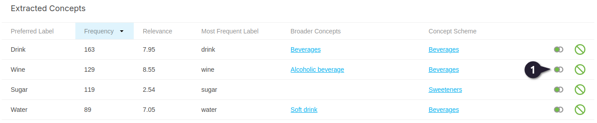

 De Similar Terms scherm opent met een lijst van vergelijkbare termen.  
 Je kunt de lijst sorteren op alfabetische volgorde van termen of op similarity score. Hoe hoger de score, hoe dichter de term qua betekenis bij het geselecteerde concept ligt. In de lijst kun je één, meerdere of alle termen selecteren door het selectievakje achter de termen aan te vinken.  

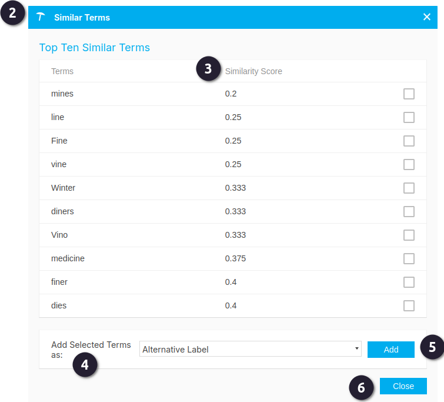

 Naast **Add Selected Terms** as kies je in het keuzemenu hoe je de termen wilt toevoegen: als *Alternative Label*, *Hidden Label* of *Narrower Concept*.

 Klik op **Add** om de geselecteerde termen toe te voegen aan het eerder gekozen concept.

 Als je klaar bent, klik je op **Close**.

---

### Extracted Terms
Op het tabblad **Extracted Terms** zie je alle termen die nog niet in je thesaurus staan, maar mogelijk relevant zijn. Veel termen zijn niet bruikbaar, maar er kunnen ook waardevolle termen tussen zitten die je kunt toevoegen.

In het geopende corpus klik je op het tabblad Extracted Terms om de lijst met geëxtraheerde termen te openen.

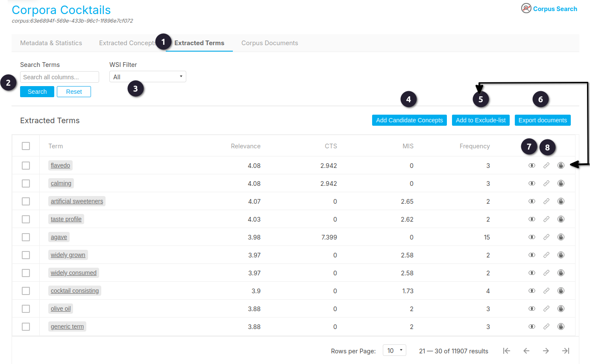

#### Beschikbare opties

- Gebruik **Search Terms** om op concepten te filteren. Klik op **Search** om de zoekopdracht te starten. Er verschijnt een lijst met resultaten. Klik op **Reset** om de volledige lijst weer te geven.

- De **WSI Filter** verwijst naar de *Word Sense Induction*-functie in PoolParty. Hiermee kun je gefilterd zoeken naar termen met een eenduidige of juist meerduidige betekenis, zoals herkend in het corpus.

- Je kunt geëxtraheerde termen selecteren en toevoegen aan de lijst **Candidate Concepts**. Selecteer één of meerdere termen met je toetsenbord en muis, en klik vervolgens op **Add Candidate Concepts**.

- Gebruik de knop of het pictogram **Add to Exclude-list** om termen uit te sluiten van verdere extractie.

- Gebruik **Export Documents** om alle documenten uit het corpus te exporteren.

- Gebruik het pictogram **Similar Terms** om een lijst te genereren met alleen termen die inhoudelijk lijken op de geselecteerde term. Meer informatie vind je in het onderdeel *Extracted Terms - Use the Similar Terms Function*.

- Gebruik het pictogram **Link** om termen te koppelen.

#### Tabelkolommen

Je kunt de volgende vier kolommen gebruiken om termen te sorteren op relevantie:

- **Relevance**: Een samengestelde score gebaseerd op de **Mutual Information Score**, de **Content Term Score** en de **frequentie** van een term. Deze totaalscore geeft een goed uitgangspunt voor het beoordelen van geëxtraheerde termen.

- **Mutual Information Score (MIS)**: Deze score geeft aan in hoeverre woorden afhankelijk van elkaar zijn. Als woorden vaker samen voorkomen dan op basis van toeval verwacht mag worden, is er sprake van afhankelijkheid – en dus mogelijk van een samengestelde term. Deze score geeft hogere waardes aan meerwoordige uitdrukkingen.

- **Content Term Score (CTS)**: Content-termen komen niet per se vaak voor in het gehele corpus, maar wél herhaaldelijk binnen individuele documenten. Dit wijst op hun belang voor de inhoud van die documenten. Deze score geeft hogere waardes aan enkelvoudige termen die inhoudelijk relevant zijn.

- **Frequency**: Het totale aantal keren dat een term voorkomt in het corpus.

#### Extracted Terms – Gebruik van de Similar Terms-functie

In dit onderdeel vind je een korte handleiding voor het gebruik van de **Similar Terms**-functie bij geëxtraheerde termen.

Na het uitvoeren van een **Corpus Analysis** en het openen van de lijst **Extracted Terms** in het bijbehorende tabblad, kun je het pictogram **Similar Terms** gebruiken om te filteren op verwante termen.

De termen in deze lijst zijn het resultaat van de corpusanalyse en kunnen helpen om je thesaurus verder aan te scherpen, bijvoorbeeld door synoniemen of nieuwe concepten te identificeren die je vanuit deze lijst kunt selecteren en toevoegen. De analyse gebruikt PoolParty’s *similarity algorithms* om deze termen te berekenen en toont ze met bijbehorende **similarity scores**. Hoe hoger de score, hoe sterker de overeenkomst met bestaande concepten in je thesaurus.

#### Hoe gebruik je de Similar Terms-functie?

 Klik op het pictogram **Similar Terms** in de lijst **Extracted Terms**, aan het einde van een rij.

 Het veld **Search Terms** wordt automatisch ingevuld met de geselecteerde term. Klik op **Search** om alleen de verwante termen te tonen in de tabel. Alle andere functies werken hetzelfde als bij de ongefilterde **Extracted Terms**-lijst.

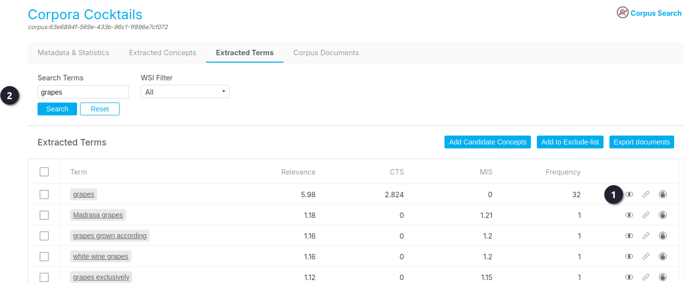

---

 Vanuit het corpus kun je terugkeren naar de bewerkbare versie van de thesaurus via de bovenste knop in het linker navigatiemenu en naar een willekeurige term in de thesaurus gaan.

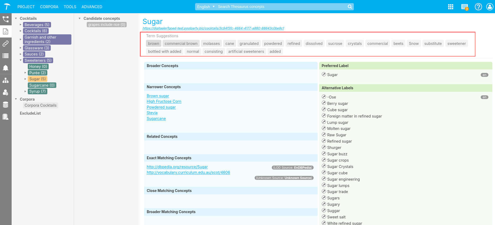

En op het tabje Documents klikken. Als er een verwijzing in het Corpus naar de term voorkomt dan zal het corpus document hier
vermeld staan.
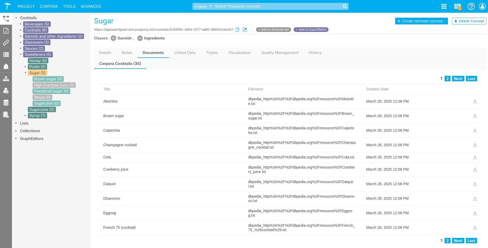

<!-- ## Documentatie

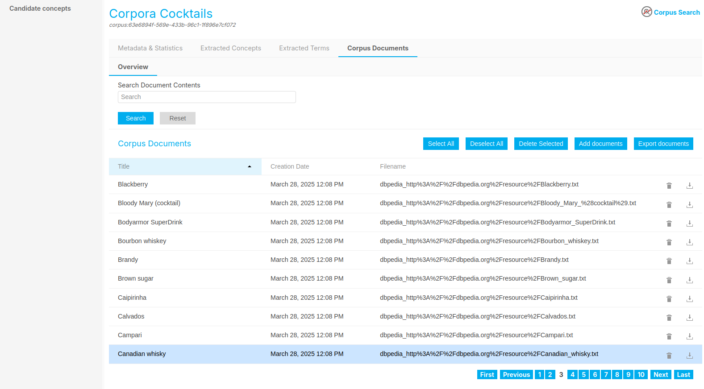

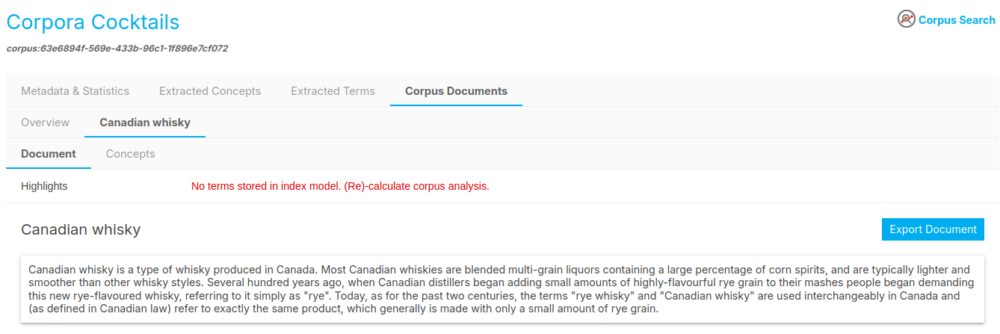 -->

<!-- Als je een term beschreven hebt en je wil je bronnen en documentatie vast leggen, dan klik
je op het tabblad Documentatie.

Je kunt referentie literatuur en bronnen toevoegen door op de Plus knoppen te klikken. Je
kunt zowel bibliografische bronnen als URLs naar websites vastleggen.
Let er bij URLs op dat je gebruik maakt van een duurzame (persistent) verwijzing. Als je
Wikipedia Citeert, klik dan aan de Linkerkant van de Wikipedia pagina altijd op de knop
“Deze pagina citeren”: en gebruik de URL die je dan in je browserbalk krijgt. -->

---

Referenties

 - Let's Party! Thesaurus beheer met Poolparty Versie 1.3

---

Zie ook:

- [Extracted Terms List](https://help.poolparty.biz/en/user-guide-for-knowledge-engineers/advanced-features/corpus-management---overview/analyse-documents-in-your-document-corpus/extracted-terms-list.html)  
- [Corpus Management - Overview](https://help.poolparty.biz/en/user-guide-for-knowledge-engineers/advanced-features/corpus-management---overview.html)

