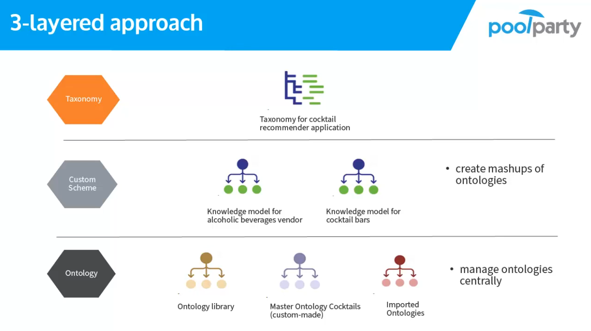
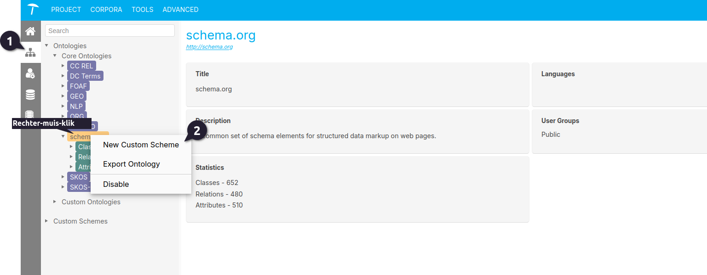
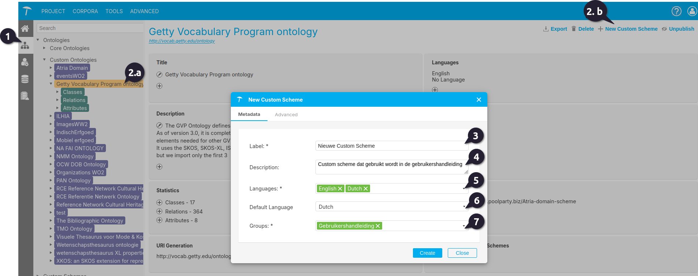
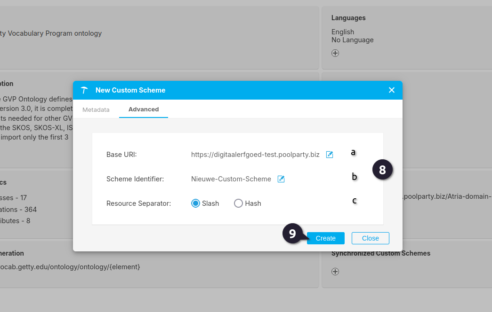
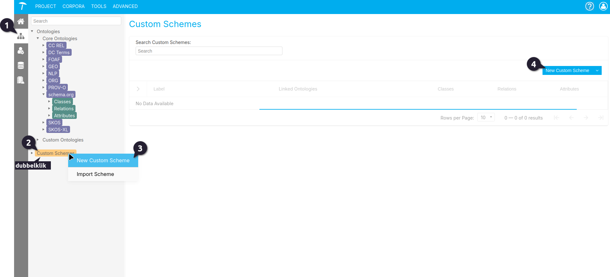

{: .no_toc .text-delta }

<!-- Overlay (only once) -->

  
  

# Custom Schemes

Dit gedeelte bevat een handleiding over hoe je custom schemes kunt maken en beheren in het PoolParty Ontology Management.

Custom schemes kunnen worden gezien als 'weergaven' van de respectieve ontologieën, waarbij je subsets van klassen, relaties en attributen uit een of meerdere ontologieën kunt definiëren.
Het wordt gebruikt om aanvullende hiërarchieën of relaties aan een thesaurus toe te voegen, naast de standaard skos:ConceptScheme-structuur. Met een custom scheme kun je een flexibele indeling creëren die beter aansluit bij specifieke domeinen, of projecten.

**Wanneer wordt een Custom Scheme gebruikt?**

- Speciale classificaties: Als je concepten wilt organiseren op een manier die niet standaard in een thesaurus voorkomt (bijvoorbeeld geografische indelingen, of productcategorieën).
- Meerdere perspectieven: Om concepten in verschillende contexten of vanuit meerdere perspectieven te bekijken zonder de hoofdstructuur te verstoren.
- Domeinspecifieke toepassingen: In vakgebieden met unieke eisen, zoals geneeskunde, juridische zaken of technische documentatie.

Het PoolParty Ontology Management biedt de volgende functies om aangepaste schema's te maken en te beheren:

1. [Custom scheme maken vanuit een ontologie]()
2. [Maken van een nieuwe Custom scheme]()
3. [Custom scheme overzicht pagina]()
4. [Voeg een taal aan de custom scheme]()
5. [Voeg een gebruikersgroep aan een custom scheme]()
6. [Verwijderen van custom schemes]()

---

### 1. Custom scheme maken vanuit een ontologie
Je kunt custom schemes maken vanuit alle vooraf [gedefinieerde ontologieën](), behalve SKOS en SKOS-XL, en alle [custom ontologieën]().

 Om te starten, open de **Ontology Management** door te klikken op de icon  in de toolbar.

Dan zijn er twee manieren om een nieuwe Custom Scheme aan te maken:

**a** Als je een custom scheme wil maken van een core ontology of custom ontology, rechter-muis-klick op de Ontology's node in de boom diagram, die zich bevindt onder **Core Ontologies** or **Custom Ontologies** en selecteer **New Custom Scheme** op de context menu. 

**b** Als je een Custom Scheme wil maken vanuit een Custom Ontology, selecteer de desbetreffende ontologie in de **Hierarchy Tree** en klik op **New Custom Scheme** link rechts.

 Geef een titel aan je custom scheme.

 Optioneel: Voeg een beschrijving toe.

 Selecteer een of meer talen voor de custom scheme.

{: .important}
> De talen die geselecteerd worden in stap 5 zullen beschikbaar zijn voor het gebruiken om labels te definieren en beschrijvingen van de klassen, relaties en attributen.

 Bij het selecteren van meer dan een taal, dient een taal de default (standaard) taal geselecteerd te worden.

 Wijs gebruikersgroepen toe aan het nieuwe custom scheme om te bepalen welke gebruikers toegang hebben tot en kunnen bewerken van het aangepaste schema.

Optioneel: In het tabblad **Advanced** kun je het URI-patroon definiëren dat wordt gebruikt voor je custom scheme. Details vind je in dit onderwerp: [Define the URI Pattern for a Custom Ontology or Custom Scheme]().

   **a** Basis-URI: Dit is al ingevuld met de instelling die is gedefinieerd voor custom schemes in het bestand poolparty.properties. Je kunt dit echter wijzigen naar een Basis-URI van jouw keuze nadat je op het potloodicoon klikt. 
   
   **b** Schema-ID: Dit is al ingevuld met de titel van het schema dat je hebt gekozen. Deze titel wordt zonder spaties gebruikt als onderdeel van de URI. Je kunt dit aanpassen nadat je op het potloodicoon klikt.
   
   **c** Resource-scheidingsteken: Gebruik de keuzerondjes om het type scheidingsteken te specificeren dat je in de URI's wilt gebruiken op basis van dit schema (standaard: schuine streep).

 Bevestig met **Create**.

Een nieuw **custom scheme** is aangemaakt. Je kunt het vinden in de lijst met **Custom Schemes**.

---

### 2. Maken van een nieuwe Custom scheme
Het maken van een nieuwe custom scheme volgt bijna dezelfde stappen als het maken vanuit een bestaande ontologie. Het enige verschil zit in de beginstappen, en het uiteindelijke invulling.

Voor het maken van een nieuwe (lege) custom scheme:

 Open de **Ontology Management** door te klikken op de icon  in de toolbar.

 Vervolgens kan de invoerformulier voor het maken van een custom scheme op drie manieren worden geopend; eerst door te navigeren naar de **Hierarchie boom** aan de linkerkant en vervolgens met de linkermuisknop dubbel te klikken op de **Custom Schemes** node.

 Het is ook mogelijk om met de rechtemuis knop te klikken op de **Custom Schemes** node en **Create Scheme** te selecteren.

 De derde manier is om te klikken met de rechtemuisknop op de **Custom Schemes** node en bij de context menu aan de rechte kant (De Detail View) te klikken op **New Custom Scheme**.

{: .important}
> De vervolgstappen zijn exact als [1. Custom scheme maken vanuit een ontologie]() stap 3 t/m 9.

Als de Custom scheme eenmaal is aangemaakt is het mogelijk om het volgende te doen:
- [6. Aanvullen van de Custom Scheme via Autocomplete]()
- [7. Voeg Klassen, Relaties en Atributten toe aan de nieuwe Custom Scheme]()

### 3. Custom scheme overzicht pagina

### 4. Voeg een taal aan de custom scheme

### 5. Voeg een gebruikersgroep aan een custom scheme

### 6. Aanvullen van de Custom Scheme via Autocomplete

### 7. Voeg Klassen, Relaties en Atributten toe aan de nieuwe Custom Scheme

### 8. Verwijderen van custom schemes

---

