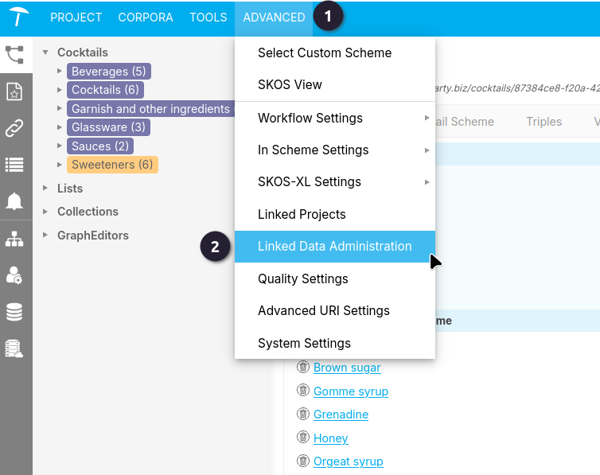
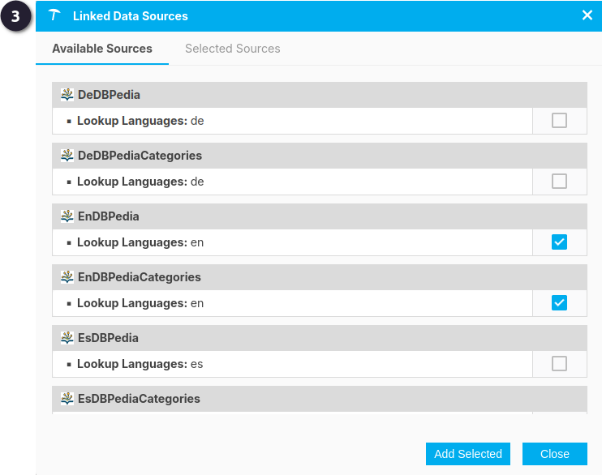
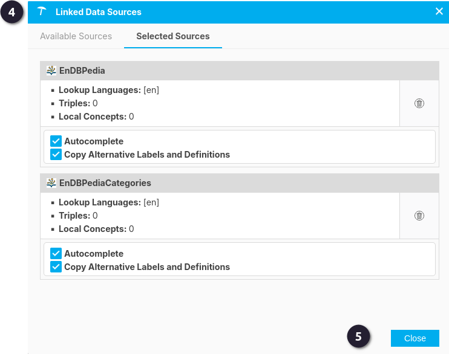
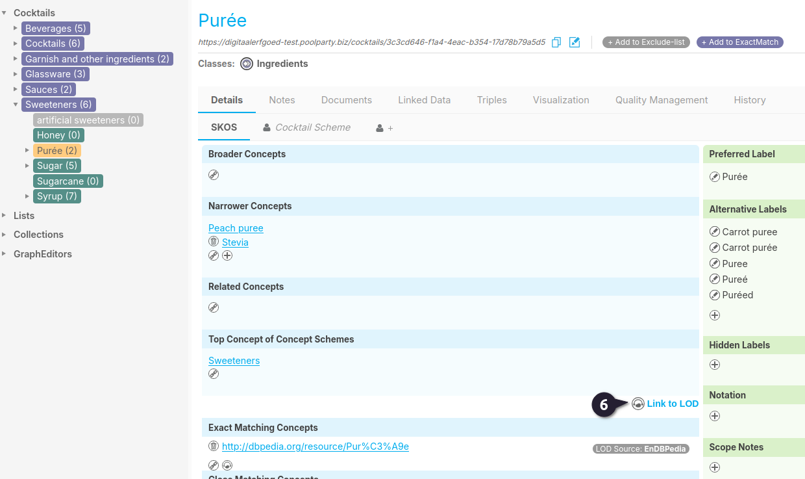
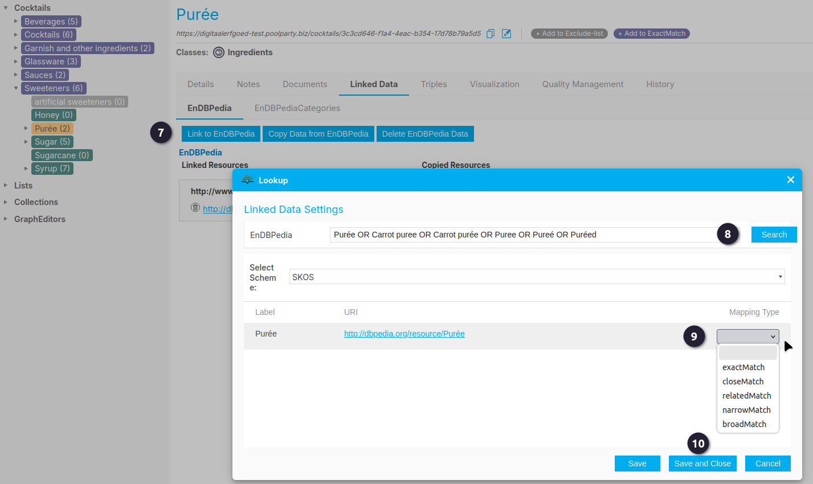
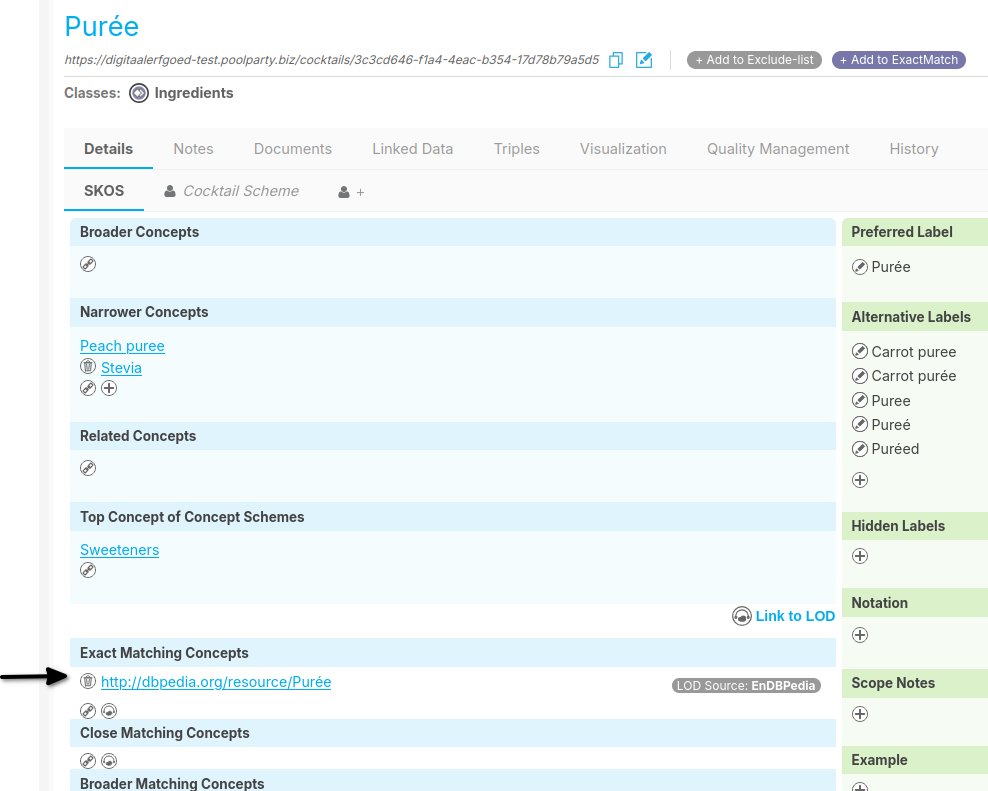

{: .no_toc .text-delta }

<!-- Overlay (only once) -->

  
  

# Linked Data toevoegen

### Standaard Linked Data-bronnen in PoolParty

De volgende Linked Data-bronnen zijn standaard beschikbaar in PoolParty:

- [**DBpedia**](https://www.dbpedia.org/) (en, de, es, fr, nl, ru): Gegevens uit Wikipedia als linked data-bron.

- [**DBpedia categories**](https://www.dbpedia.org/) (en, de, es, fr, nl, ru): Wikipedia-categorieën als linked data.

- [**GeoNames**](http://www.geonames.org/): Geografische databank met dekking van alle landen.

- [**Getty Vocabularies**](http://www.getty.edu/research/tools/vocabularies/) (AAT, TGN, ULAN): Terminologie voor kunst, architectuur, decoratieve kunsten, archiefmateriaal, visuele representaties, conservering en bibliografisch materiaal.

- [**PermID**](https://permid.org/about): Gegevens over organisaties, financiële instrumenten, fondsen, uitgevers en personen. *Vereist een API-sleutel.*

- [**LCSH**](https://id.loc.gov/) (Library of Congress Subject Headings, en): Programmatic toegang tot verschillende databronnen van de Library of Congress, zoals onderwerpstermen.

- [**WordNet**](https://wordnet.princeton.edu/) (en): Lexicale databank van het Engels.

- [**Wikidata**](https://www.wikidata.org/wiki/Wikidata:Main_Page) (en): Semantische versie van Wikipedia.

### Gegevens opzoeken via het semantisch web

Er zijn twee manieren om het **Lookup**-dialoogvenster te openen waarmee je een concept kunt koppelen aan bronnen uit beschikbare Linked Data-bronnen.

---

### Voorwaarden voor Linked Data Lookup in PoolParty

 Koppel het project aan Linked Open Data via **Advanced**.

 En selecteer **Linked Data Administration**.

 Selecteer de **Linked Data bronnen** waar een gekoppeling gewenst is. En **Add selected**.

 In het tabblad **Selected Sources** kan er nog gekozen worden voor *Autocomplete* en *Copy Alternative Labels and Definition*.  
 Als de keuzes gemaakt zijn kan het venster gesloten worden.

---

### Gegevens opzoeken voor je thesaurus

- Ga in het **Thesaurus Management** naar het **SKOS-tabblad** van een custom scheme, top concept of concept.
In dit voorbeeld is het topconcept *'Sweetners'* geopend en wordt het **SKOS-tabblad** (blauwe gedeelte) weergegeven. 

 Gebruik de link **Link to LOD** om het **Lookup**-dialoogvenster te openen.

> Let op:
> - De link wordt alleen weergegeven als er eerder Linked Data-bronnen zijn geselecteerd voor het project via de **Linked Data Administration** (stap 1-5).
> - Je moet daarnaast de **Advanced view** inschakelen voor het SKOS-tabblad.

 Klik in het tabblad **Linked Data** op **Link to EnDBPedia** om het **Lookup**-dialoogvenster te openen.

Voor elke gekoppelde Linked Data-bron wordt een apart tabblad weergegeven. Hier kun je het concept koppelen aan externe bronnen en de gekoppelde gegevens beheren. Als er geen bronnen zijn geselecteerd voor het project, wordt een melding weergegeven.

 De zoekbalk is al ingevuld met de term en logica van het concept. Door op **Search** te klikken, verschijnen termen als suggesties. Met **Select Scheme** kan er bepaald worden hoe een gevonden term gekoppeld kan worden.

 In dit voorbeeld is het mogelijk om voor SKOS, te kiezen uit `exactMatch`, `closeMatch`, `relatedMatch`, `narrowMatch`, en `broadMatch`. Hier in dit voorbeeld is gekozen voor `exactMatch`.

 Als een keus gemaakt is dan kan het venster gesloten worden.

Eenmaal terug naar de *Detail* tabblad van het concept, is het nieuwe Linked Data koppeling te vinden onder `exactMatch`. Ook staat het erbij waar de term vandaan komt, in dit geval *EnDBPedia*.

---
Zie ook:

- [Lookup Data from the Semantic Web](https://help.poolparty.biz/en/user-guide-for-knowledge-engineers/advanced-features/linked-data-management---overview/linked-data-enrichment-with-poolparty/lookup-data-from-the-semantic-web.html)