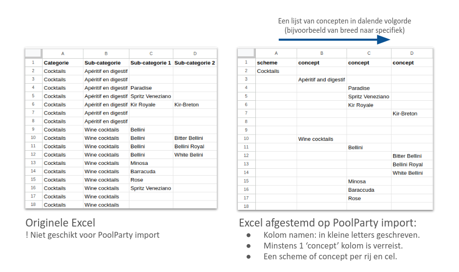
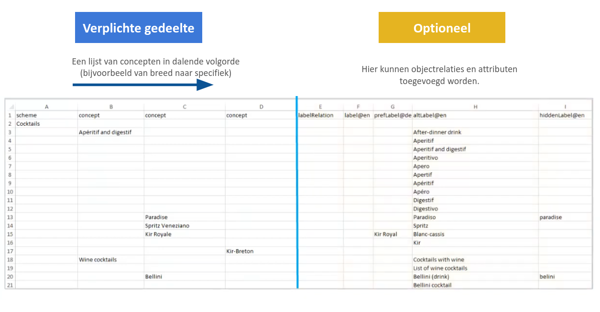
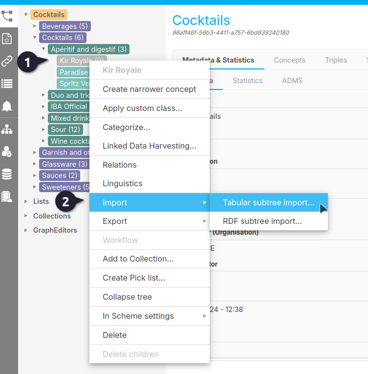
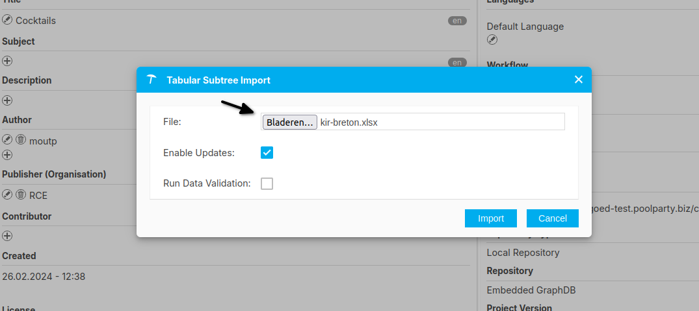
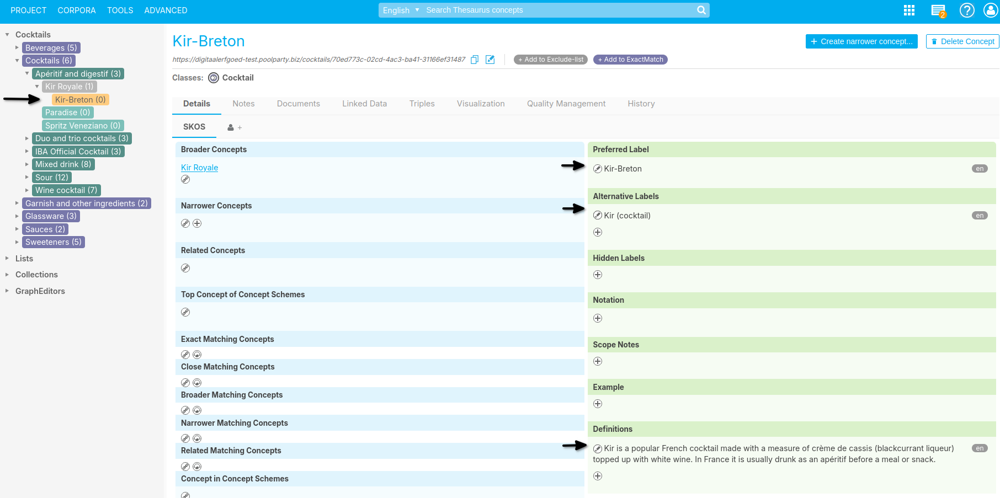

{: .no_toc .text-delta }

<!-- Overlay (only once) -->

  
  

# Importeren van termen met een tabel, Excel of CSV.

In deze handleiding wordt uitgelegd hoe je Excel- en CSV-bestanden kunt gebruiken om gegevens te importeren in PoolParty.

PoolParty ondersteunt twee hoofdprincipes voor tabulaire import en export:
1. Nieuwe Gegevens Importeren: Dit omvat het creëren van een nieuw project of het toevoegen van nieuwe concepten aan een bestaande thesaurus.
2. Gegevens Toevoegen aan Bestaande Taxonomieën: Hierbij voeg je extra eigenschappen, labels of relaties toe aan reeds bestaande concepten zonder bestaande waarden te overschrijven. ​

Voor een succesvolle import moeten Excel-bestanden aan specifieke indelingsregels voldoen:
- **Kolomkoppen**: Moeten in kleine letters zijn.
- **Vaste Sectie**: Bevat verplichte kolommen in een specifieke volgorde:  
       - uri/notation/<custom attribute> (optioneel): Indien aanwezig, moet dit de eerste kolom zijn.
       - scheme (verplicht): Bevat een of meer conceptschemes.
       - concept (verplicht): Een of meer kolommen met topconcepten of concepten.

- **Optionele Sectie**: Hier kun je extra SKOS-attributen, relaties en aangepaste attributen toevoegen.

## Gegevens Importeren

Om nieuwe gegevens te importeren:
1. Open PoolParty-project.
2. Klik op 'PROJECT' in de hoofdwerkbalk.
3. Selecteer 'Importeren' en vervolgens 'Tabulaire Projectimport'.
4. Kies het pad naar de betreffende Excel- of CSV-bestand.
5. Optioneel: Vink 'Updates Inschakelen' aan om bestaande gegevens bij te werken.
6. Bevestig met 'Importeren'. ​

## Gegevens Toevoegen aan Bestaande Taxonomieën

Om bestaande gegevens uit te breiden:
Volg dezelfde stappen als hierboven.

Zorg ervoor dat 'Updates Inschakelen' is aangevinkt om nieuwe gegevens toe te voegen zonder bestaande waarden te overschrijven. ​

---

## Gegevens Exporteren

Om een PoolParty-project naar een Excel- of CSV-bestand te exporteren:
1. Open PoolParty-project.
2. Klik met de rechtermuisknop op 'PROJECT'.
3. Selecteer 'Exporteren' en vervolgens 'Tabulaire Projectexport'.
4. Kies de gewenste exporttalen en het formaat (Excel of CSV).
5. Klik op 'Exporteren' en sla het bestand op.

## Veelvoorkomende Fouten en Oplossingen

- Fout: Polyhiërarchieën worden omgezet in individuele concepten.
       - Oplossing: Vink tijdens het importeren de optie 'Updates Inschakelen' aan om polyhiërarchieën te behouden.

- Fout: Bestaande waarden worden niet overschreven tijdens het toevoegen van gegevens.
       - Oplossing: Houd er rekening mee dat PoolParty bestaande gegevens niet overschrijft bij het toevoegen van nieuwe gegevens; het voegt alleen toe aan bestaande concepten. ​

---

Zie ook:

- [PoolParty Excel & CSV Tabular Import & Export - Overview](https://help.poolparty.biz/en/user-guide-for-knowledge-engineers/basic-features/import,-export-and-reporting-with-poolparty/poolparty-excel---csv-tabular-import---export---overview.html)
- [PoolParty Excel & CSV Tabular Import & Export - Principles and Use Cases](https://help.poolparty.biz/en/user-guide-for-knowledge-engineers/basic-features/import,-export-and-reporting-with-poolparty/poolparty-excel---csv-tabular-import---export---overview/poolparty-excel---csv-tabular-import---export---principles-and-use-cases.html)
- [The PoolParty Excel Format](https://help.poolparty.biz/en/user-guide-for-knowledge-engineers/basic-features/import,-export-and-reporting-with-poolparty/poolparty-excel---csv-tabular-import---export---overview/the-poolparty-excel-format.html)
- [Add Data via Excel](https://help.poolparty.biz/en/user-guide-for-knowledge-engineers/basic-features/import,-export-and-reporting-with-poolparty/poolparty-excel---csv-tabular-import---export---overview/add-data-via-excel.html)
- [2.11 How to import and export Excel Sheets](https://help.poolparty.biz/en/user-guide-for-knowledge-engineers/basic-features/import,-export-and-reporting-with-poolparty/poolparty-excel---csv-tabular-import---export---overview.html)